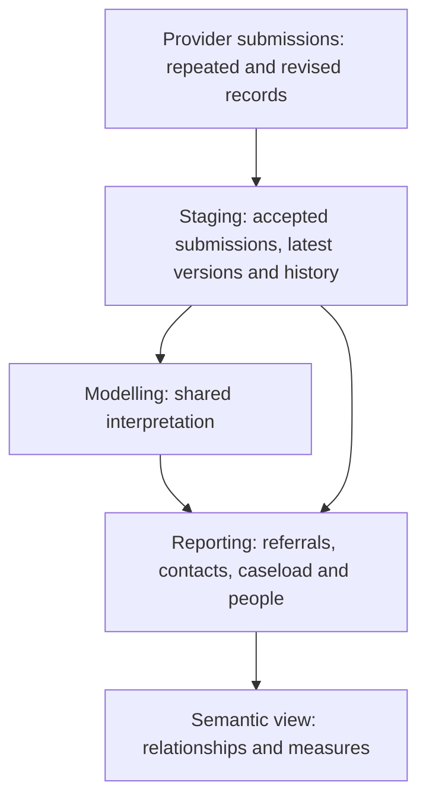

# CSDS: from submissions to useful reporting

## Goal of the layer

Make the Community Services Data Set (CSDS) simple to query for questions about
people, referrals, community care and waiting. Analysts should be able to pick a
reporting table, filter its dates and use its measures without writing their own
submission selection, deduplication or code lookups. Currency costing is kept
separate from ordinary care reporting.

Start in `REPORTING.COMMUNITY` or `REPORTING.SEMANTIC.SEM_CSDS`. The person
summary is an entry point for cohorts; referral, contact and period tables answer
questions it cannot.

## Why the source tables need preparation

CSDS is a monthly resubmission feed. A referral, contact or patient record can
appear in many months and be corrected later, so counting source rows counts
repeats, and picking an older version can leave a status out of date. Several
identifiers only make sense within one submission: contact identifiers are reused
across referrals, and a contact's team is described by the referral's team rows
in the same file.

## What each layer does

- **Staging (`STAGING.CSDS`)** keeps accepted submissions only. `_history` models
  hold every accepted monthly occurrence. The latest models select the newest
  reported record for each key in the national specification (ETOS), by reporting
  period, then receipt time, submission and source row.
- **Modelling (`MODELLING.COMMUNITY`)** owns rules several outputs share.
- **Reporting (`REPORTING.COMMUNITY`)** gives analysts entities with a stated
  grain, labels and measures.

## Questions and where to start

| Analyst question | Start with | What it describes |
|---|---|---|
| What do we know about each person? | `fct_csds_person_summary`, `dim_csds_person_provider_period` | Current evidence per person; demographics and residence per person, provider and month. |
| Who is on the current recorded caseload? | `fct_csds_current_caseload_referral`, `fct_csds_current_caseload_person` | Open referrals in the dataset's latest month, including those awaiting a first attended contact. |
| What referrals were made and what followed? | `fct_csds_referral`, `fct_csds_referral_summary` | Latest referrals, with contacts, activities, teams and clocks under each. |
| What was the referral state in a past month? | `fct_csds_referral_period` | Open state and attendance evidence at each accepted period end. |
| Which teams were involved? | `fct_csds_referral_service` | Latest referral/team relationships, each with its own closure or rejection. |
| What care took place? | `fct_csds_care_contact`, `fct_csds_care_activity` | Contacts in all attendance states with delivering team type; activities within contacts. |
| What clinical detail was recorded? | `fct_csds_clinical_record` | Immunisations, assessment responses, procedures, findings and observations. |
| How quickly were people seen? | `fct_csds_referral_to_treatment_period` | Submitted referral-to-treatment and response clocks, including the two-hour urgent community response flag. |
| How recent is each provider's data? | `dq_csds_provider_submission`, `fct_csds_latest_provider_caseload_referral` | Provider submission dates and lag; open referrals in each provider's latest month. |
| What do contacts cost? | `fct_csds_currency_contacts` | NHSE community currency and proxy cost per contact. See the [currency guide](csds-currency-models.md). |

## What remains in modelling

| Responsibility | Model | Why it is shared |
|---|---|---|
| Contact team and practice | `int_csds_care_contact_context` | Contact reporting, currencies and later outputs need the same team type and GP practice for each contact. |
| Person population | `int_csds_person_evidence` | Sets who has evidence, and of what kind, before the summary reduces it to one row per person. |
| Observation date | `int_csds_reporting_date` | Current measures share one dataset date. |
| Currency classification | `int_csds_contact_currency`, `int_csds_currency_referral_service_type` | Costing classifies by the referral's single team type, which is narrower than general care reporting. |

## Definitions that matter

- **Open referral.** CSDS records closure and rejection on each team, not on the
  referral. A referral is open at a period end when it was received, has no
  service discharge, and at least one of its teams is still open.
- **Attendance.** Codes 5 and 6 are attended, 3 and 7 did not attend, 2 and 4
  cancelled by patient or provider. Missing attendance stays missing.
- **Delivering team type.** Taken from the contact's own team in the same
  submission. Some providers record contact teams that never appear on their
  referrals; those contacts take the referral's team type only when it is
  unambiguous, and `service_or_team_type_basis` says which route applied.
- **Residence.** Some providers put retired 2011 LSOA codes in the 2021 field; the
  demographics dimension bridges them to find the local authority.

## Boundaries

Current means current in the available feed. Several providers stopped submitting
CSDS between 2018 and 2024; the current caseload excludes them, and the
latest-provider caseload keeps them with their lag. Health visiting and school
nursing referrals legitimately stay open for years. An open referral without
attendance is evidence of waiting, not eligibility for a national waiting-time
standard. Clock records repeat monthly, so row counts are not distinct clocks.
Assessment rows are responses, not completed questionnaires. National person ID
changes can split one person across rows.

Sections not yet modelled include group sessions, staff details, child health
screening (newborn hearing, blood spot, infant physical examination),
breastfeeding, safeguarding and special educational needs.
