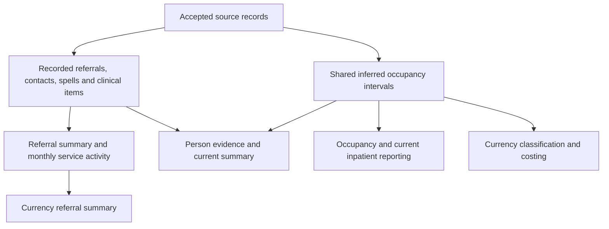

# MHSDS reporting models

Use `REPORTING.MENTAL_HEALTH` for recorded care, clinical evidence and analytical
summaries. Models are grouped into `referrals`, `activity`, `inpatient`,
`clinical`, `person`, `quality` and `currencies` folders. These folders retain the
same warehouse schema. Development uses `DEV__REPORTING.MENTAL_HEALTH`.

## Choose a model for the question

| Question | Model | One row represents |
|---|---|---|
| What happened to this referral? | `fct_mhsds_referral` | Latest recorded service request |
| How much care followed each referral, and when was its first attended contact? | `fct_mhsds_referral_summary` | Referral with contact, service and recorded-spell measures |
| Which teams were involved, and in which roles? | `rel_mhsds_referral_service_team` | Referral, team and relationship role |
| What contacts were recorded, including DNAs and cancellations? | `fct_mhsds_care_contact` | Latest recorded referral/contact pair |
| How does activity vary by service and month? | `fct_mhsds_service_activity_monthly` | Provider, resolved team identifiers, team type and contact month |
| What work and clinical components were submitted within a contact? | `fct_mhsds_care_activity` | Accepted provider-period activity occurrence |
| Which professionals were linked to an activity? | `rel_mhsds_care_activity_staff` | Recorded activity/professional relationship |
| What were the professional's attributes at that time? | `dim_mhsds_care_professional_period` | Accepted professional snapshot |
| What admissions and discharges did providers record? | `fct_mhsds_hospital_provider_spell` | Latest recorded provider-qualified spell |
| How did a person move between wards? | `fct_mhsds_ward_stay` | Latest recorded ward stay |
| What occupancy intervals do the agreed overlap and recency rules retain? | `fct_mhsds_inpatient_occupancy` | Retained inferred interval |
| Who has evidence of a current inpatient stay? | `fct_mhsds_current_inpatients` | Person with a retained open interval |
| What diagnoses were recorded? | `fct_mhsds_diagnosis` | Retained diagnosis evidence item |
| What assessment responses were recorded? | `fct_mhsds_assessment_observation` | Accepted assessment question, dimension or score occurrence |
| What legal-status periods were recorded? | `fct_mhsds_mental_health_act_period` | Latest recorded legal-status period |
| What evidence and recent activity do we have for each person? | `fct_mhsds_person_summary` | Identifiable MHSDS person |
| How recent are each provider's accepted submissions? | `dq_mhsds_provider_submission` | Provider and accepted reporting period |

`fct_mhsds_clinical_record` remains the full clinical-item history, combining
diagnoses, assessments and populated activity components. The diagnosis and
assessment models provide focused projections of that established evidence.
They reuse its identity, clinical time, label and response interpretation rules.

## Shared definitions and currencies



Modelling owns shared transformations and rules. Reporting owns supported
entities and analytical outputs. A shared rule can consume an established
reporting entity; folder order does not require another copy of its SQL.

`int_mhsds_inpatient_occupancy` owns the existing interval-selection rules.
Cross-system encounters and inpatient currency classification both consume it.
Contact currency eligibility uses the same intervals, retaining its existing
inclusive admission-to-end date exclusion.

`int_mhsds_currency_referral_service_type` retains the currency-specific choice
of one service type per referral. It resolves MHS102, then MHS902, then MHS101
information. This is different from the primary, referred-to and additional
relationships in `rel_mhsds_referral_service_team`.

The `currencies` folder contains `fct_mhsds_currency_contacts`,
`fct_mhsds_currency_bed_days`, `fct_mhsds_currency_referral_summary` and
`fct_mhsds_currency_current_inpatients`. Currency classifications do not choose
the general person population, diagnosis evidence or recorded spell counts.
See [currency definitions](mhsds-currency-models.md).

## Time and source history

There are three relevant clocks:

- Clinical dates describe when a referral, contact or clinical item was recorded
  as occurring. Missing time-of-day is not invented.
- Reporting periods describe the accepted submission evidence. Source-file
  receipt describes delivery, not care.
- Calculation dates describe when inferred rules and elapsed durations were
  evaluated.

`int_mhsds_reporting_date` supplies the latest accepted dataset period.
The person summary publishes it as `as_of_date`. Its 12-month and 90-day contact
windows include both boundaries and exclude later contact dates. All attendance
states contribute to contact counts; attended, DNA and cancelled counts are
separate. A cancelled appointment is not evidence of delivered care.

Occupancy deliberately retains the previous freshness anchor: the latest period
among staged hospital spells. It can differ from the dataset observation date.
Both are visible. `days_since_admission` in the census accrues to
`duration_calculation_date`; it is not a count of evidenced occupied bed days.

`stg_mhsds_referral_history` and `stg_mhsds_referral_service_team_history` retain
accepted period records before latest-state selection. Contacts already have an
accepted-history staging interface. These allow period-specific investigation.
They do not reconstruct superseded rejected files or establish a historical
caseload definition by themselves.

The submission-quality model reports accepted source row counts and provider
freshness. Source counts are not newly received referrals, event-date activity
or distinct people. Missing periods are absent, and an empty section does not
by itself prove an incomplete submission.

## Counting and joining

A contact joins its recorded referral using
`referral_source_record_id = fct_mhsds_referral.source_record_id`. Use a left join
when retaining contacts whose referral is absent.

That join supplies the latest referral revision. The contact fact also exposes
the referral person and receipt date from its own submission, with separate
linkage and person-consistency flags. MHSDS person identifiers can change after
national matching or demographic changes. A later referral person disagreement
does not establish that the historical contact belongs to a different patient.
The referral summary counts those disagreements but keeps all linked contacts
and its descriptive intervals. No person identifiers are remapped.

`int_mhsds_care_contact_context` resolves the delivering team within each contact
submission. An explicit additional-team pointer takes precedence, followed by
the legacy contact pointer. In v6, a contact without either pointer uses the
primary team on its same-submission referral. An explicit unmatched pointer
stays unresolved rather than inheriting a different team's type. The contact
and activity facts share this rule. Attribution basis and monthly missing-type
counts distinguish a missing pointer from missing team details.
Source-derived team identifiers can be populated when the submitted local
pointer is blank; these do not establish a delivering team. The resolved team
identifier follows the selected local pointer, rather than retaining an
unsupported derived identifier. Original fields remain available in staging.

These rules follow [MHSDS v6 user guidance, sections 4.1 and MHS201](https://digital.nhs.uk/binaries/content/assets/website-assets/data-and-information/datasets/mhsds/tools-and-guidance/mhsdsv6.0_userguidance_v6.0.4.pdf).
The [provider and system change guidance](https://digital.nhs.uk/data-and-information/data-collections-and-data-sets/data-sets/mental-health-services-data-set/submit-data/guidance-on-changes-in-care-provider-provider-identifier-or-system-supplier)
explains person-ID changes and carrying original referral dates across system
changes. Long recorded referral intervals need investigation, not automatic
exclusion.

Activities use accepted provider-period identity and same-submission contact
context. The latest contact fact has a different time grain. Joining activities
to that fact deliberately substitutes revised contact context; it does not
recreate the submitted parent. Activities are not additional contacts.

Team and staff relationships are one-to-many. Joining them before counting
referrals or contacts can multiply counts. The referral summary aggregates
children before joining. Monthly activity counts come directly from contacts.
Distinct-person counts in a monthly row cannot be added across services or
months.

Recorded ward stays join `hospital_provider_spell_source_record_id` to the
recorded spell's `source_record_id`. Occupancy reporting exposes the same source
spell key alongside its established `occupancy_interval_id`. The latter matches
the spell number used by encounter and currency models.

Recorded spells and retained occupancy intervals answer different questions.
Occupancy can discard contained spells and truncate an earlier interval at a
later admission. The person summary exposes both counts and both sets of dates.

## Person summary

`fct_mhsds_person_summary` includes every non-null person in the documented
modelled evidence families. `int_mhsds_person_evidence` provides those families,
record counts and observed periods. They include clinical-only records,
legal-status-only records, MPI snapshots and orphan relationships. Bridging maps
people to cross-system patient keys without requiring a bridge or creating
population members.

The grain is a recorded MHSDS person identifier. National identity changes can
split one individual's history across identifiers. Distinct-person measures
count those recorded IDs; they do not promise a reconciled longitudinal patient
population. See the [coverage review](mhsds-domain-review.md) for useful source
sections still outside these reporting families.

Counts describe available recorded history, not lifetime care. In particular:

- `n_referrals_without_recorded_end` is not an active caseload. It counts the
  existing referral status with no recorded rejection or discharge.
- `n_primary_diagnosis_records` counts retained items, including undated and
  unlabelled evidence. It does not count distinct conditions. The latest
  recorded timestamp and number of tied records are exposed; no arbitrary
  single diagnosis is selected and no diagnosis is declared clinically current.
- `n_assessment_observations` does not count completed questionnaires. Referral
  assessments use completion evidence; activity assessments may inherit the
  linked activity time. Improvement measures still need instrument-specific
  completion and pairing definitions.
- Occupancy and detention flags keep their existing definitions. False means
  no qualifying evidence. Legal-status periods retain unknown-code visibility.
  Patient-indicator values remain null when unknown, with their evidence date.

The profile deliberately has no currency-derived diagnosis category or generic
crisis-contact flag. Use the explicitly named currency classifications when that
is the intended definition.

## Semantic view

[`sem_mhsds`](../models/semantic/sem_mhsds.sql) exposes the domain through
`REPORTING.SEMANTIC.SEM_MHSDS`. It provides referral access, attendance,
recorded-spell, occupancy, diagnosis-evidence, assessment-observation,
legal-status, person and submission measures. Currency classifications and
costs remain in the currency models.

Each metric belongs to its own entity. Person relationships support current
cohorts, such as contact counts for people with current detention evidence.
They do not reconstruct detention at the contact date. Unfiltered breakdowns
retain a null person-state group for records without identity; filtering on a
person attribute excludes that group. Submission metrics stand alone because
provider-period evidence has a different population and time grain.

The view includes distinct-person measures for referrals, contacts and
diagnoses. These are calculated over the selected records, rather than added
across service or month totals. The first-attendance mean has a separate
observed-interval denominator. It excludes referrals without a valid observed
interval and is not waiting-time target compliance.

For example, this query returns aggregate recorded contact activity by month:

```sql
select
    date_trunc('month', contact_date) as contact_month,
    sum(contact_count) as recorded_contacts,
    sum(attended_contact_count) as attended_contacts,
    sum(dna_contact_count) as dna_contacts
from semantic_view(
    REPORTING.SEMANTIC.SEM_MHSDS
    metrics contacts.contact_count,
        contacts.attended_contact_count,
        contacts.dna_contact_count
    dimensions contacts.contact_date
)
group by 1
order by 1;
```

The semantic test reconciles entity counts to the domain and checks that
contact and diagnosis breakdowns by person state preserve their totals.
Domain models test the primary keys used by the relationships.

## Interface changes

| Previous interface | Replacement |
|---|---|
| `dim_person_mh_profile` | `fct_mhsds_person_summary`, with broader population and explicit measure names |
| `fct_mhsds_referral_episodes` | `fct_mhsds_referral_summary` for general access; `fct_mhsds_currency_referral_summary` for classifications |
| `stg_mhsds_servicetype` | `int_mhsds_currency_referral_service_type` in modelling |
| Currency-enriched `fct_mhsds_current_inpatients` | General census keeps this name; currency output moves to `fct_mhsds_currency_current_inpatients` |

The profile's `n_*_ever` names are replaced by recorded-history counts.
Its single currency-selected ICD-10 code/category is replaced by diagnosis
record counts and latest-time evidence, with `fct_mhsds_diagnosis` for detail.
The general census uses `occupancy_interval_id` and
`hospital_provider_spell_source_record_id` rather than source-specific spell
column names. There are no compatibility views.

dbt does not drop the retired relations automatically. After deployment,
warehouse cleanup should remove `REPORTING.MENTAL_HEALTH.DIM_PERSON_MH_PROFILE`,
`REPORTING.MENTAL_HEALTH.FCT_MHSDS_REFERRAL_EPISODES` and
`STAGING.MHSDS.STG_MHSDS_SERVICETYPE`, plus their DEV equivalents. Until removed,
those copies are stale and unsupported. Deploy the replacements before cleanup.

For the source clinical interpretation and its limits, see the
[clinical-record design](mhsds-clinical-record-plan.md).
