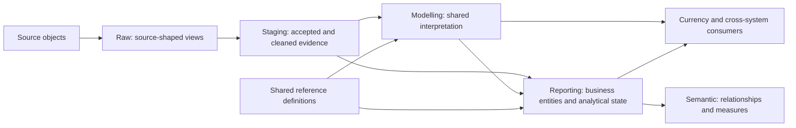

# MHSDS: from source evidence to business-conformed reporting

The MHSDS domain turns accepted provider submissions into reusable concepts for
analysis: referrals, contacts, clinical evidence, inpatient intervals, period
state and person summaries. This document lists each model along that arc and
shows where source evidence acquires a business meaning.

Inventory checked against the dbt manifest for commit `059bb82e`, 19 September
2026. Names link to SQL; adjacent YAML files hold the full descriptions and tests.
"Table" in the discussion includes views. The Object column states the dbt
materialisation. Only model and source metadata appear here, not patient data.

## Read the arc



| Stage | What changes | What the stage does not establish |
|---|---|---|
| Raw | Generated views rename source columns and preserve source rows. | Acceptance, record identity or clinical meaning. |
| Source-conformed staging | Accepted-submission selection, source types, date cleaning and documented source keys. History and established latest interfaces remain distinct. | That each submitted row is a new clinical event. |
| Shared modelling | Version selection, same-submission context, evidence assembly and reusable rules such as inferred occupancy. | A universal clinical truth beyond the stated evidence and rule. |
| Business-conformed reporting | Named analytical concepts with explicit grains, populations, time bases, labels and measures. | National waiting-list eligibility, clinical improvement or live occupancy unless separately defined. |
| Semantic | Relationships and aggregate measures over the reporting entities. | A second implementation of the business definitions. |

Business-conformed means the analyst can choose a meaningful entity and rely on
its documented interpretation. It does not mean all facts have the same grain,
that historical evidence is current, or that MHSDS person identifiers form a
reconciled patient register across systems.

The diagram explains responsibilities, not a requirement for an intermediate
table at every step. Reporting can read staging directly. Shared modelling can
reuse an established reporting entity when that avoids duplicating its rule.
The dependency columns below show the actual immediate care-model inputs.
Reference inputs are listed separately.

## Navigation and inventory scope

- [Source objects and raw views](#source-objects-and-raw-views)
- [Source-conformed staging](#source-conformed-staging)
- [Shared domain modelling](#shared-domain-modelling)
- [Business-conformed reporting](#business-conformed-reporting)
- [Currency and encounter consumers](#currency-and-encounter-consumers)
- [Semantic interface](#semantic-interface)
- [Reference definitions](#reference-definitions)
- [Other shared inputs](#other-shared-inputs)
- [Direct consumers outside the MHSDS family](#direct-consumers-outside-the-mhsds-family)

The inventory includes every model with `mhsds` in its name and every model in
the mental-health folders, including the existing SLAM cost companion. It also
lists their direct shared model inputs, seed inputs and immediate external model
consumers. It stops at those shared boundaries rather than reproducing the whole
project's transitive lineage. Raw-only source sections are included explicitly.
Presence of a generated raw view does not establish usable data coverage.

## Where the objects live

| Models | Production namespace |
|---|---|
| Generated raw views | `STAGING.DBT_RAW` |
| MHSDS staging | `STAGING.MHSDS` |
| UKHFD reference staging | `STAGING.UKHFD` |
| MHSDS shared modelling | `MODELLING.MENTAL_HEALTH` |
| MHSDS reporting, including currencies | `REPORTING.MENTAL_HEALTH` |
| Dictionary definitions | `REFERENCE.DATA_DICTIONARY` |
| Clinical terminology | `REFERENCE.TERMINOLOGY` |
| MHSDS semantic view | `REPORTING.SEMANTIC` |

The tracked `dev` target uses the configured `DEV__` layers. Reporting family
folders organise responsibilities within the same schema; they do not create
new databases. Shared inputs retain their own configured locations.

## Three examples through the layers

1. **Referrals and caseload.** `MHS101Referral` becomes accepted referral history.
   `fct_mhsds_referral_period` adds period-specific access state and attendance
   known by that period end. Latest-provider caseload preserves older evidence;
   current caseload selects the dataset latest month. The person summary and
   semantic counts reuse those outputs.
2. **Spells and occupancy.** `MHS501HospProvSpell` becomes recorded spell state.
   `int_mhsds_inpatient_occupancy` applies the established interval rules.
   General occupancy reporting, the inpatient census, encounter adaptation and
   currency classification share those intervals. Recorded spells and inferred
   occupancy remain different analytical entities.
3. **Assessments and score changes.** Accepted responses and historical clustering
   evidence enter the shared clinical-record model. Assessment observations add
   published response interpretation. Instance groups and adjacent eligible score
   pairs answer different questions at different grains. Neither proves a
   completed questionnaire or clinical improvement.

## Source objects and raw views

Each raw view has the same source-row grain as its physical input. It performs no
business selection. All objects below are in `DATA_LAKE.MHSDS`; source names are
case-sensitive. The final column shows direct model consumers of the raw view.
Use staging for analysis and further model development.

| Source object | Generated raw view | Direct use or coverage gap |
| --- | --- | --- |
| `"ActiveSubmission"` | [raw_mhsds_activesubmission](../models/raw/commissioning/raw_mhsds_activesubmission.sql) | [stg_mhsds_activesubmission](../models/staging/commissioning/mhsds/stg_mhsds_activesubmission.sql) |
| `"bridging"` | [raw_mhsds_bridging](../models/raw/commissioning/raw_mhsds_bridging.sql) | [stg_mhsds_bridging](../models/staging/commissioning/mhsds/stg_mhsds_bridging.sql) |
| `"MHS000Header"` | [raw_mhsds_mhs000header](../models/raw/commissioning/raw_mhsds_mhs000header.sql) | [stg_mhsds_activesubmission](../models/staging/commissioning/mhsds/stg_mhsds_activesubmission.sql)<br>[stg_source_content_freshness](../models/staging/shared/stg_source_content_freshness.sql) |
| `"MHS001MPI"` | [raw_mhsds_mhs001mpi](../models/raw/commissioning/raw_mhsds_mhs001mpi.sql) | [stg_mhsds_mpi_history](../models/staging/commissioning/mhsds/stg_mhsds_mpi_history.sql) |
| `"MHS002GP"` | [raw_mhsds_mhs002gp](../models/raw/commissioning/raw_mhsds_mhs002gp.sql) | Raw only; no staging or domain consumer. |
| `"MHS003AccommStatus"` | [raw_mhsds_mhs003accommstatus](../models/raw/commissioning/raw_mhsds_mhs003accommstatus.sql) | [stg_mhsds_accommodation](../models/staging/commissioning/mhsds/stg_mhsds_accommodation.sql) |
| `"MHS004EmpStatus"` | [raw_mhsds_mhs004empstatus](../models/raw/commissioning/raw_mhsds_mhs004empstatus.sql) | [stg_mhsds_employment](../models/staging/commissioning/mhsds/stg_mhsds_employment.sql) |
| `"MHS005PatInd"` | [raw_mhsds_mhs005patind](../models/raw/commissioning/raw_mhsds_mhs005patind.sql) | [stg_mhsds_patientindicators](../models/staging/commissioning/mhsds/stg_mhsds_patientindicators.sql) |
| `"MHS006MHCareCoord"` | [raw_mhsds_mhs006mhcarecoord](../models/raw/commissioning/raw_mhsds_mhs006mhcarecoord.sql) | Raw only; no staging or domain consumer. |
| `"MHS007DisabilityType"` | [raw_mhsds_mhs007disabilitytype](../models/raw/commissioning/raw_mhsds_mhs007disabilitytype.sql) | [stg_mhsds_disability](../models/staging/commissioning/mhsds/stg_mhsds_disability.sql) |
| `"MHS008CarePlanType"` | [raw_mhsds_mhs008careplantype](../models/raw/commissioning/raw_mhsds_mhs008careplantype.sql) | [stg_mhsds_care_plan](../models/staging/commissioning/mhsds/stg_mhsds_care_plan.sql) |
| `"MHS009CarePlanAgreement"` | [raw_mhsds_mhs009careplanagreement](../models/raw/commissioning/raw_mhsds_mhs009careplanagreement.sql) | [stg_mhsds_care_plan_agreement](../models/staging/commissioning/mhsds/stg_mhsds_care_plan_agreement.sql) |
| `"MHS010AssTechToSupportDisTyp"` | [raw_mhsds_mhs010asstechtosupportdistyp](../models/raw/commissioning/raw_mhsds_mhs010asstechtosupportdistyp.sql) | Raw only; no staging or domain consumer. |
| `"MHS011SocPerCircumstances"` | [raw_mhsds_mhs011socpercircumstances](../models/raw/commissioning/raw_mhsds_mhs011socpercircumstances.sql) | [stg_mhsds_social_circumstance](../models/staging/commissioning/mhsds/stg_mhsds_social_circumstance.sql) |
| `"MHS012OverseasVisitorChargCat"` | [raw_mhsds_mhs012overseasvisitorchargcat](../models/raw/commissioning/raw_mhsds_mhs012overseasvisitorchargcat.sql) | Raw only; no staging or domain consumer. |
| `"MHS013MHCurrencyModel"` | [raw_mhsds_mhs013mhcurrencymodel](../models/raw/commissioning/raw_mhsds_mhs013mhcurrencymodel.sql) | Raw only; no staging or domain consumer. |
| `"MHS101Referral"` | [raw_mhsds_mhs101referral](../models/raw/commissioning/raw_mhsds_mhs101referral.sql) | [stg_mhsds_referral_history](../models/staging/commissioning/mhsds/stg_mhsds_referral_history.sql) |
| `"MHS102ServiceTypeReferredTo"` | [raw_mhsds_mhs102servicetypereferredto](../models/raw/commissioning/raw_mhsds_mhs102servicetypereferredto.sql) | [stg_mhsds_referral_service_team_history](../models/staging/commissioning/mhsds/stg_mhsds_referral_service_team_history.sql) |
| `"MHS103OtherReasonReferral"` | [raw_mhsds_mhs103otherreasonreferral](../models/raw/commissioning/raw_mhsds_mhs103otherreasonreferral.sql) | Raw only; no staging or domain consumer. |
| `"MHS104RTT"` | [raw_mhsds_mhs104rtt](../models/raw/commissioning/raw_mhsds_mhs104rtt.sql) | [stg_mhsds_referral_to_treatment](../models/staging/commissioning/mhsds/stg_mhsds_referral_to_treatment.sql) |
| `"MHS105OnwardReferral"` | [raw_mhsds_mhs105onwardreferral](../models/raw/commissioning/raw_mhsds_mhs105onwardreferral.sql) | Raw only; no staging or domain consumer. |
| `"MHS106DischargePlanAgreement"` | [raw_mhsds_mhs106dischargeplanagreement](../models/raw/commissioning/raw_mhsds_mhs106dischargeplanagreement.sql) | Raw only; no staging or domain consumer. |
| `"MHS107MedicationPrescription"` | [raw_mhsds_mhs107medicationprescription](../models/raw/commissioning/raw_mhsds_mhs107medicationprescription.sql) | Raw only; no staging or domain consumer. |
| `"MHS201CareContact"` | [raw_mhsds_mhs201carecontact](../models/raw/commissioning/raw_mhsds_mhs201carecontact.sql) | [stg_mhsds_carecontact](../models/staging/commissioning/mhsds/stg_mhsds_carecontact.sql) |
| `"MHS202CareActivity"` | [raw_mhsds_mhs202careactivity](../models/raw/commissioning/raw_mhsds_mhs202careactivity.sql) | [stg_mhsds_care_activity](../models/staging/commissioning/mhsds/stg_mhsds_care_activity.sql) |
| `"MHS203OtherAttend"` | [raw_mhsds_mhs203otherattend](../models/raw/commissioning/raw_mhsds_mhs203otherattend.sql) | Raw only; no staging or domain consumer. |
| `"MHS204IndirectActivity"` | [raw_mhsds_mhs204indirectactivity](../models/raw/commissioning/raw_mhsds_mhs204indirectactivity.sql) | [stg_mhsds_indirectactivity](../models/staging/commissioning/mhsds/stg_mhsds_indirectactivity.sql) |
| `"MHS205PatientSDDI"` | [raw_mhsds_mhs205patientsddi](../models/raw/commissioning/raw_mhsds_mhs205patientsddi.sql) | Raw only; no staging or domain consumer. |
| `"MHS206StaffActivity"` | [raw_mhsds_mhs206staffactivity](../models/raw/commissioning/raw_mhsds_mhs206staffactivity.sql) | [stg_mhsds_staff_activity](../models/staging/commissioning/mhsds/stg_mhsds_staff_activity.sql) |
| `"MHS301GroupSession"` | [raw_mhsds_mhs301groupsession](../models/raw/commissioning/raw_mhsds_mhs301groupsession.sql) | [stg_mhsds_group_session](../models/staging/commissioning/mhsds/stg_mhsds_group_session.sql) |
| `"MHS302MHDropInContact"` | [raw_mhsds_mhs302mhdropincontact](../models/raw/commissioning/raw_mhsds_mhs302mhdropincontact.sql) | [stg_mhsds_drop_in_contact](../models/staging/commissioning/mhsds/stg_mhsds_drop_in_contact.sql) |
| `"MHS401MHActPeriod"` | [raw_mhsds_mhs401mhactperiod](../models/raw/commissioning/raw_mhsds_mhs401mhactperiod.sql) | [stg_mhsds_mhactperiod](../models/staging/commissioning/mhsds/stg_mhsds_mhactperiod.sql) |
| `"MHS402RespClinicianAssignment"` | [raw_mhsds_mhs402respclinicianassignment](../models/raw/commissioning/raw_mhsds_mhs402respclinicianassignment.sql) | Raw only; no staging or domain consumer. |
| `"MHS403ConditionalDischarge"` | [raw_mhsds_mhs403conditionaldischarge](../models/raw/commissioning/raw_mhsds_mhs403conditionaldischarge.sql) | Raw only; no staging or domain consumer. |
| `"MHS404CommTreatOrder"` | [raw_mhsds_mhs404commtreatorder](../models/raw/commissioning/raw_mhsds_mhs404commtreatorder.sql) | [stg_mhsds_community_treatment_order](../models/staging/commissioning/mhsds/stg_mhsds_community_treatment_order.sql) |
| `"MHS405CommTreatOrderRecall"` | [raw_mhsds_mhs405commtreatorderrecall](../models/raw/commissioning/raw_mhsds_mhs405commtreatorderrecall.sql) | [stg_mhsds_community_treatment_order_recall](../models/staging/commissioning/mhsds/stg_mhsds_community_treatment_order_recall.sql) |
| `"MHS501HospProvSpell"` | [raw_mhsds_mhs501hospprovspell](../models/raw/commissioning/raw_mhsds_mhs501hospprovspell.sql) | [stg_mhsds_spell](../models/staging/commissioning/mhsds/stg_mhsds_spell.sql) |
| `"MHS502WardStay"` | [raw_mhsds_mhs502wardstay](../models/raw/commissioning/raw_mhsds_mhs502wardstay.sql) | [stg_mhsds_ward_stay_history](../models/staging/commissioning/mhsds/stg_mhsds_ward_stay_history.sql) |
| `"MHS503AssignedCareProf"` | [raw_mhsds_mhs503assignedcareprof](../models/raw/commissioning/raw_mhsds_mhs503assignedcareprof.sql) | Raw only; no staging or domain consumer. |
| `"MHS504DelayedDischarge"` | [raw_mhsds_mhs504delayeddischarge](../models/raw/commissioning/raw_mhsds_mhs504delayeddischarge.sql) | Raw only; no staging or domain consumer. |
| `"MHS505RestrictiveInterventInc"` | [raw_mhsds_mhs505restrictiveinterventinc](../models/raw/commissioning/raw_mhsds_mhs505restrictiveinterventinc.sql) | [stg_mhsds_restrictive_intervention_incident](../models/staging/commissioning/mhsds/stg_mhsds_restrictive_intervention_incident.sql) |
| `"MHS505RestrictiveIntervention"` | [raw_mhsds_mhs505restrictiveintervention](../models/raw/commissioning/raw_mhsds_mhs505restrictiveintervention.sql) | Raw only; no staging or domain consumer. |
| `"MHS506Assault"` | [raw_mhsds_mhs506assault](../models/raw/commissioning/raw_mhsds_mhs506assault.sql) | Raw only; no staging or domain consumer. |
| `"MHS507SelfHarm"` | [raw_mhsds_mhs507selfharm](../models/raw/commissioning/raw_mhsds_mhs507selfharm.sql) | Raw only; no staging or domain consumer. |
| `"MHS509HomeLeave"` | [raw_mhsds_mhs509homeleave](../models/raw/commissioning/raw_mhsds_mhs509homeleave.sql) | [stg_mhsds_home_leave](../models/staging/commissioning/mhsds/stg_mhsds_home_leave.sql) |
| `"MHS510LeaveOfAbsence"` | [raw_mhsds_mhs510leaveofabsence](../models/raw/commissioning/raw_mhsds_mhs510leaveofabsence.sql) | [stg_mhsds_leave_of_absence](../models/staging/commissioning/mhsds/stg_mhsds_leave_of_absence.sql) |
| `"MHS511AbsenceWithoutLeave"` | [raw_mhsds_mhs511absencewithoutleave](../models/raw/commissioning/raw_mhsds_mhs511absencewithoutleave.sql) | [stg_mhsds_absence_without_leave](../models/staging/commissioning/mhsds/stg_mhsds_absence_without_leave.sql) |
| `"MHS512HospSpellComm"` | [raw_mhsds_mhs512hospspellcomm](../models/raw/commissioning/raw_mhsds_mhs512hospspellcomm.sql) | [stg_mhsds_spell_commissioner_period](../models/staging/commissioning/mhsds/stg_mhsds_spell_commissioner_period.sql) |
| `"MHS513SubstanceMisuse"` | [raw_mhsds_mhs513substancemisuse](../models/raw/commissioning/raw_mhsds_mhs513substancemisuse.sql) | Raw only; no staging or domain consumer. |
| `"MHS514TrialLeave"` | [raw_mhsds_mhs514trialleave](../models/raw/commissioning/raw_mhsds_mhs514trialleave.sql) | Raw only; no staging or domain consumer. |
| `"MHS515RestrictiveInterventType"` | [raw_mhsds_mhs515restrictiveinterventtype](../models/raw/commissioning/raw_mhsds_mhs515restrictiveinterventtype.sql) | [stg_mhsds_restrictive_intervention_type](../models/staging/commissioning/mhsds/stg_mhsds_restrictive_intervention_type.sql) |
| `"MHS516PoliceAssistanceRequest"` | [raw_mhsds_mhs516policeassistancerequest](../models/raw/commissioning/raw_mhsds_mhs516policeassistancerequest.sql) | Raw only; no staging or domain consumer. |
| `"MHS517SMHExceptionalPackofCare"` | [raw_mhsds_mhs517smhexceptionalpackofcare](../models/raw/commissioning/raw_mhsds_mhs517smhexceptionalpackofcare.sql) | Raw only; no staging or domain consumer. |
| `"MHS518ClinReadyforDischarge"` | [raw_mhsds_mhs518clinreadyfordischarge](../models/raw/commissioning/raw_mhsds_mhs518clinreadyfordischarge.sql) | [stg_mhsds_discharge_readiness](../models/staging/commissioning/mhsds/stg_mhsds_discharge_readiness.sql) |
| `"MHS601MedHistPrevDiag"` | [raw_mhsds_mhs601medhistprevdiag](../models/raw/commissioning/raw_mhsds_mhs601medhistprevdiag.sql) | [stg_mhsds_previous_diagnosis](../models/staging/commissioning/mhsds/stg_mhsds_previous_diagnosis.sql) |
| `"MHS603ProvDiag"` | [raw_mhsds_mhs603provdiag](../models/raw/commissioning/raw_mhsds_mhs603provdiag.sql) | [stg_mhsds_provisional_diagnosis](../models/staging/commissioning/mhsds/stg_mhsds_provisional_diagnosis.sql) |
| `"MHS604PrimDiag"` | [raw_mhsds_mhs604primdiag](../models/raw/commissioning/raw_mhsds_mhs604primdiag.sql) | [stg_mhsds_primdiag](../models/staging/commissioning/mhsds/stg_mhsds_primdiag.sql) |
| `"MHS605SecDiag"` | [raw_mhsds_mhs605secdiag](../models/raw/commissioning/raw_mhsds_mhs605secdiag.sql) | [stg_mhsds_secondary_diagnosis](../models/staging/commissioning/mhsds/stg_mhsds_secondary_diagnosis.sql) |
| `"MHS606CodedScoreAssessmentRefer"` | [raw_mhsds_mhs606codedscoreassessmentrefer](../models/raw/commissioning/raw_mhsds_mhs606codedscoreassessmentrefer.sql) | [stg_mhsds_referral_assessment](../models/staging/commissioning/mhsds/stg_mhsds_referral_assessment.sql) |
| `"MHS607CodedScoreAssessmentAct"` | [raw_mhsds_mhs607codedscoreassessmentact](../models/raw/commissioning/raw_mhsds_mhs607codedscoreassessmentact.sql) | [stg_mhsds_activity_assessment](../models/staging/commissioning/mhsds/stg_mhsds_activity_assessment.sql) |
| `"MHS608AnonSelfAssess"` | [raw_mhsds_mhs608anonselfassess](../models/raw/commissioning/raw_mhsds_mhs608anonselfassess.sql) | Raw only; no staging or domain consumer. |
| `"MHS609PresComp"` | [raw_mhsds_mhs609prescomp](../models/raw/commissioning/raw_mhsds_mhs609prescomp.sql) | [stg_mhsds_presenting_complaint](../models/staging/commissioning/mhsds/stg_mhsds_presenting_complaint.sql) |
| `"MHS701CPACareEpisode"` | [raw_mhsds_mhs701cpacareepisode](../models/raw/commissioning/raw_mhsds_mhs701cpacareepisode.sql) | Raw only; no staging or domain consumer. |
| `"MHS702CPAReview"` | [raw_mhsds_mhs702cpareview](../models/raw/commissioning/raw_mhsds_mhs702cpareview.sql) | Raw only; no staging or domain consumer. |
| `"MHS801ClusterTool"` | [raw_mhsds_mhs801clustertool](../models/raw/commissioning/raw_mhsds_mhs801clustertool.sql) | [stg_mhsds_clustering_assessment](../models/staging/commissioning/mhsds/stg_mhsds_clustering_assessment.sql) |
| `"MHS802ClusterAssess"` | [raw_mhsds_mhs802clusterassess](../models/raw/commissioning/raw_mhsds_mhs802clusterassess.sql) | [stg_mhsds_clustering_assessment_response](../models/staging/commissioning/mhsds/stg_mhsds_clustering_assessment_response.sql) |
| `"MHS803CareCluster"` | [raw_mhsds_mhs803carecluster](../models/raw/commissioning/raw_mhsds_mhs803carecluster.sql) | Raw only; no staging or domain consumer. |
| `"MHS804FiveForensicPathways"` | [raw_mhsds_mhs804fiveforensicpathways](../models/raw/commissioning/raw_mhsds_mhs804fiveforensicpathways.sql) | Raw only; no staging or domain consumer. |
| `"MHS901StaffDetails"` | [raw_mhsds_mhs901staffdetails](../models/raw/commissioning/raw_mhsds_mhs901staffdetails.sql) | [stg_mhsds_staff_details](../models/staging/commissioning/mhsds/stg_mhsds_staff_details.sql) |
| `"MHS902ServiceTeamDetails"` | [raw_mhsds_mhs902serviceteamdetails](../models/raw/commissioning/raw_mhsds_mhs902serviceteamdetails.sql) | [stg_mhsds_service_or_team_details](../models/staging/commissioning/mhsds/stg_mhsds_service_or_team_details.sql) |
| `"MHS903WardDetails"` | [raw_mhsds_mhs903warddetails](../models/raw/commissioning/raw_mhsds_mhs903warddetails.sql) | [stg_mhsds_mhs903warddetails](../models/staging/commissioning/mhsds/stg_mhsds_mhs903warddetails.sql) |

## Source-conformed staging

These are the source interfaces for accepted MHSDS evidence. The accepted-period
macro also depends on `stg_mhsds_activesubmission`; its repeated appearance in the
input column is intentional. A latest interface can follow a history interface
for the same source section.

| Model | Object | Grain and responsibility | Direct care-model inputs |
| --- | --- | --- | --- |
| [stg_mhsds_absence_without_leave](../models/staging/commissioning/mhsds/stg_mhsds_absence_without_leave.sql) | view | Accepted MHS511 absence without leave evidence across provider reporting periods. One row per submitted source record. | [raw_mhsds_mhs511absencewithoutleave](../models/raw/commissioning/raw_mhsds_mhs511absencewithoutleave.sql)<br>[stg_mhsds_activesubmission](../models/staging/commissioning/mhsds/stg_mhsds_activesubmission.sql) |
| [stg_mhsds_accommodation](../models/staging/commissioning/mhsds/stg_mhsds_accommodation.sql) | view | Accepted MHS003 accommodation evidence across provider reporting periods. One row per submitted source record. | [raw_mhsds_mhs003accommstatus](../models/raw/commissioning/raw_mhsds_mhs003accommstatus.sql)<br>[stg_mhsds_activesubmission](../models/staging/commissioning/mhsds/stg_mhsds_activesubmission.sql) |
| [stg_mhsds_activesubmission](../models/staging/commissioning/mhsds/stg_mhsds_activesubmission.sql) | view | One accepted MHSDS submission per provider and reporting period. | [raw_mhsds_mhs000header](../models/raw/commissioning/raw_mhsds_mhs000header.sql)<br>[raw_mhsds_activesubmission](../models/raw/commissioning/raw_mhsds_activesubmission.sql) |
| [stg_mhsds_activity_assessment](../models/staging/commissioning/mhsds/stg_mhsds_activity_assessment.sql) | table | Accepted MHS607 clinical source records. One row per submitted record across accepted provider reporting periods. | [raw_mhsds_mhs607codedscoreassessmentact](../models/raw/commissioning/raw_mhsds_mhs607codedscoreassessmentact.sql)<br>[stg_mhsds_activesubmission](../models/staging/commissioning/mhsds/stg_mhsds_activesubmission.sql) |
| [stg_mhsds_bridging](../models/staging/commissioning/mhsds/stg_mhsds_bridging.sql) | view | One row per MHSDS person identifier, linked to the pseudonymised patient key. | [raw_mhsds_bridging](../models/raw/commissioning/raw_mhsds_bridging.sql) |
| [stg_mhsds_care_activity](../models/staging/commissioning/mhsds/stg_mhsds_care_activity.sql) | table | Accepted MHS202 care activities. One row represents one care activity in one provider reporting period. | [raw_mhsds_mhs202careactivity](../models/raw/commissioning/raw_mhsds_mhs202careactivity.sql)<br>[stg_mhsds_activesubmission](../models/staging/commissioning/mhsds/stg_mhsds_activesubmission.sql) |
| [stg_mhsds_care_plan](../models/staging/commissioning/mhsds/stg_mhsds_care_plan.sql) | view | Accepted MHS008 care plan evidence across provider reporting periods. One row per submitted source record. | [raw_mhsds_mhs008careplantype](../models/raw/commissioning/raw_mhsds_mhs008careplantype.sql)<br>[stg_mhsds_activesubmission](../models/staging/commissioning/mhsds/stg_mhsds_activesubmission.sql) |
| [stg_mhsds_care_plan_agreement](../models/staging/commissioning/mhsds/stg_mhsds_care_plan_agreement.sql) | view | Accepted MHS009 care plan agreement evidence across provider reporting periods. One row per submitted source record. | [raw_mhsds_mhs009careplanagreement](../models/raw/commissioning/raw_mhsds_mhs009careplanagreement.sql)<br>[stg_mhsds_activesubmission](../models/staging/commissioning/mhsds/stg_mhsds_activesubmission.sql) |
| [stg_mhsds_carecontact](../models/staging/commissioning/mhsds/stg_mhsds_carecontact.sql) | table | MHSDS care contacts from accepted provider submissions. One row per reporting period, unique service request and unique care contact. | [raw_mhsds_mhs201carecontact](../models/raw/commissioning/raw_mhsds_mhs201carecontact.sql)<br>[stg_mhsds_activesubmission](../models/staging/commissioning/mhsds/stg_mhsds_activesubmission.sql) |
| [stg_mhsds_clustering_assessment](../models/staging/commissioning/mhsds/stg_mhsds_clustering_assessment.sql) | view | Accepted MHS801 clustering assessment evidence across provider reporting periods. One row per submitted source record. | [raw_mhsds_mhs801clustertool](../models/raw/commissioning/raw_mhsds_mhs801clustertool.sql)<br>[stg_mhsds_activesubmission](../models/staging/commissioning/mhsds/stg_mhsds_activesubmission.sql) |
| [stg_mhsds_clustering_assessment_response](../models/staging/commissioning/mhsds/stg_mhsds_clustering_assessment_response.sql) | view | Accepted MHS802 clustering assessment response evidence across provider reporting periods. One row per submitted source record. | [raw_mhsds_mhs802clusterassess](../models/raw/commissioning/raw_mhsds_mhs802clusterassess.sql)<br>[stg_mhsds_activesubmission](../models/staging/commissioning/mhsds/stg_mhsds_activesubmission.sql) |
| [stg_mhsds_community_treatment_order](../models/staging/commissioning/mhsds/stg_mhsds_community_treatment_order.sql) | view | Accepted MHS404 community treatment order evidence across provider reporting periods. One row per submitted source record. | [raw_mhsds_mhs404commtreatorder](../models/raw/commissioning/raw_mhsds_mhs404commtreatorder.sql)<br>[stg_mhsds_activesubmission](../models/staging/commissioning/mhsds/stg_mhsds_activesubmission.sql) |
| [stg_mhsds_community_treatment_order_recall](../models/staging/commissioning/mhsds/stg_mhsds_community_treatment_order_recall.sql) | view | Accepted MHS405 community treatment order recall evidence across provider reporting periods. One row per submitted source record. | [raw_mhsds_mhs405commtreatorderrecall](../models/raw/commissioning/raw_mhsds_mhs405commtreatorderrecall.sql)<br>[stg_mhsds_activesubmission](../models/staging/commissioning/mhsds/stg_mhsds_activesubmission.sql) |
| [stg_mhsds_disability](../models/staging/commissioning/mhsds/stg_mhsds_disability.sql) | view | Accepted MHS007 disability evidence across provider reporting periods. One row per submitted source record. | [raw_mhsds_mhs007disabilitytype](../models/raw/commissioning/raw_mhsds_mhs007disabilitytype.sql)<br>[stg_mhsds_activesubmission](../models/staging/commissioning/mhsds/stg_mhsds_activesubmission.sql) |
| [stg_mhsds_discharge_readiness](../models/staging/commissioning/mhsds/stg_mhsds_discharge_readiness.sql) | view | Accepted MHS518 discharge readiness evidence across provider reporting periods. One row per submitted source record. | [raw_mhsds_mhs518clinreadyfordischarge](../models/raw/commissioning/raw_mhsds_mhs518clinreadyfordischarge.sql)<br>[stg_mhsds_activesubmission](../models/staging/commissioning/mhsds/stg_mhsds_activesubmission.sql) |
| [stg_mhsds_drop_in_contact](../models/staging/commissioning/mhsds/stg_mhsds_drop_in_contact.sql) | view | Accepted MHS302 drop in contact evidence across provider reporting periods. One row per submitted source record. | [raw_mhsds_mhs302mhdropincontact](../models/raw/commissioning/raw_mhsds_mhs302mhdropincontact.sql)<br>[stg_mhsds_activesubmission](../models/staging/commissioning/mhsds/stg_mhsds_activesubmission.sql) |
| [stg_mhsds_employment](../models/staging/commissioning/mhsds/stg_mhsds_employment.sql) | view | Accepted MHS004 employment evidence across provider reporting periods. One row per submitted source record. | [raw_mhsds_mhs004empstatus](../models/raw/commissioning/raw_mhsds_mhs004empstatus.sql)<br>[stg_mhsds_activesubmission](../models/staging/commissioning/mhsds/stg_mhsds_activesubmission.sql) |
| [stg_mhsds_group_session](../models/staging/commissioning/mhsds/stg_mhsds_group_session.sql) | view | Accepted MHS301 group session evidence across provider reporting periods. One row per submitted source record. | [raw_mhsds_mhs301groupsession](../models/raw/commissioning/raw_mhsds_mhs301groupsession.sql)<br>[stg_mhsds_activesubmission](../models/staging/commissioning/mhsds/stg_mhsds_activesubmission.sql) |
| [stg_mhsds_home_leave](../models/staging/commissioning/mhsds/stg_mhsds_home_leave.sql) | view | Accepted MHS509 home leave evidence across provider reporting periods. One row per submitted source record. | [raw_mhsds_mhs509homeleave](../models/raw/commissioning/raw_mhsds_mhs509homeleave.sql)<br>[stg_mhsds_activesubmission](../models/staging/commissioning/mhsds/stg_mhsds_activesubmission.sql) |
| [stg_mhsds_indirectactivity](../models/staging/commissioning/mhsds/stg_mhsds_indirectactivity.sql) | view | MHSDS indirect activity performed for a patient without the patient present. One row per MHS204 activity from the accepted file for its activity reporting period. | [raw_mhsds_mhs204indirectactivity](../models/raw/commissioning/raw_mhsds_mhs204indirectactivity.sql)<br>[stg_mhsds_activesubmission](../models/staging/commissioning/mhsds/stg_mhsds_activesubmission.sql) |
| [stg_mhsds_leave_of_absence](../models/staging/commissioning/mhsds/stg_mhsds_leave_of_absence.sql) | view | Accepted MHS510 leave of absence evidence across provider reporting periods. One row per submitted source record. | [raw_mhsds_mhs510leaveofabsence](../models/raw/commissioning/raw_mhsds_mhs510leaveofabsence.sql)<br>[stg_mhsds_activesubmission](../models/staging/commissioning/mhsds/stg_mhsds_activesubmission.sql) |
| [stg_mhsds_mhactperiod](../models/staging/commissioning/mhsds/stg_mhsds_mhactperiod.sql) | table | MHSDS Mental Health Act legal-status periods. Grain: one row per uniq_mh_act_episode_id, using the newest reporting period and then the latest received submission within that period. | [raw_mhsds_mhs401mhactperiod](../models/raw/commissioning/raw_mhsds_mhs401mhactperiod.sql)<br>[stg_mhsds_activesubmission](../models/staging/commissioning/mhsds/stg_mhsds_activesubmission.sql) |
| [stg_mhsds_mhs502wardstay](../models/staging/commissioning/mhsds/stg_mhsds_mhs502wardstay.sql) | table | One row per MHSDS unique ward-stay identifier from the newest accepted submission in which it appears. Identifier reuse across spells is kept as a reported source-quality issue rather than split into inferred stays. | [stg_mhsds_ward_stay_history](../models/staging/commissioning/mhsds/stg_mhsds_ward_stay_history.sql)<br>[stg_mhsds_activesubmission](../models/staging/commissioning/mhsds/stg_mhsds_activesubmission.sql) |
| [stg_mhsds_mhs903warddetails](../models/staging/commissioning/mhsds/stg_mhsds_mhs903warddetails.sql) | table | MHSDS ward-detail snapshots. Grain: one row per accepted submission and provider-qualified ward. | [raw_mhsds_mhs903warddetails](../models/raw/commissioning/raw_mhsds_mhs903warddetails.sql)<br>[stg_mhsds_activesubmission](../models/staging/commissioning/mhsds/stg_mhsds_activesubmission.sql) |
| [stg_mhsds_mpi_history](../models/staging/commissioning/mhsds/stg_mhsds_mpi_history.sql) | view | Accepted MHS001 monthly patient snapshots. Grain: one row per MHS001 source record. | [raw_mhsds_mhs001mpi](../models/raw/commissioning/raw_mhsds_mhs001mpi.sql)<br>[stg_mhsds_activesubmission](../models/staging/commissioning/mhsds/stg_mhsds_activesubmission.sql) |
| [stg_mhsds_other_service_or_team_type](../models/staging/commissioning/mhsds/stg_mhsds_other_service_or_team_type.sql) | table | Latest MHS102 relationship records. One row per referral and available service or team identifier. | [stg_mhsds_referral_service_team_history](../models/staging/commissioning/mhsds/stg_mhsds_referral_service_team_history.sql) |
| [stg_mhsds_patientindicators](../models/staging/commissioning/mhsds/stg_mhsds_patientindicators.sql) | table | Accepted MHSDS patient indicator records (MHS005), including child-protection and looked-after status. Grain: one row per MHS005 source record. | [raw_mhsds_mhs005patind](../models/raw/commissioning/raw_mhsds_mhs005patind.sql)<br>[stg_mhsds_activesubmission](../models/staging/commissioning/mhsds/stg_mhsds_activesubmission.sql) |
| [stg_mhsds_presenting_complaint](../models/staging/commissioning/mhsds/stg_mhsds_presenting_complaint.sql) | view | Accepted MHS609 presenting complaint evidence across provider reporting periods. One row per submitted source record. | [raw_mhsds_mhs609prescomp](../models/raw/commissioning/raw_mhsds_mhs609prescomp.sql)<br>[stg_mhsds_activesubmission](../models/staging/commissioning/mhsds/stg_mhsds_activesubmission.sql) |
| [stg_mhsds_previous_diagnosis](../models/staging/commissioning/mhsds/stg_mhsds_previous_diagnosis.sql) | table | Accepted MHS601 clinical source records. One row per submitted record across accepted provider reporting periods. | [raw_mhsds_mhs601medhistprevdiag](../models/raw/commissioning/raw_mhsds_mhs601medhistprevdiag.sql)<br>[stg_mhsds_activesubmission](../models/staging/commissioning/mhsds/stg_mhsds_activesubmission.sql) |
| [stg_mhsds_primdiag](../models/staging/commissioning/mhsds/stg_mhsds_primdiag.sql) | table | Accepted MHS604 clinical source records. One row per submitted record across accepted provider reporting periods. | [raw_mhsds_mhs604primdiag](../models/raw/commissioning/raw_mhsds_mhs604primdiag.sql)<br>[stg_mhsds_activesubmission](../models/staging/commissioning/mhsds/stg_mhsds_activesubmission.sql) |
| [stg_mhsds_provisional_diagnosis](../models/staging/commissioning/mhsds/stg_mhsds_provisional_diagnosis.sql) | table | Accepted MHS603 clinical source records. One row per submitted record across accepted provider reporting periods. | [raw_mhsds_mhs603provdiag](../models/raw/commissioning/raw_mhsds_mhs603provdiag.sql)<br>[stg_mhsds_activesubmission](../models/staging/commissioning/mhsds/stg_mhsds_activesubmission.sql) |
| [stg_mhsds_referral](../models/staging/commissioning/mhsds/stg_mhsds_referral.sql) | table | MHSDS referrals from active provider submissions. One row per unique service request. | [stg_mhsds_referral_history](../models/staging/commissioning/mhsds/stg_mhsds_referral_history.sql) |
| [stg_mhsds_referral_assessment](../models/staging/commissioning/mhsds/stg_mhsds_referral_assessment.sql) | table | Accepted MHS606 clinical source records. One row per submitted record across accepted provider reporting periods. | [raw_mhsds_mhs606codedscoreassessmentrefer](../models/raw/commissioning/raw_mhsds_mhs606codedscoreassessmentrefer.sql)<br>[stg_mhsds_activesubmission](../models/staging/commissioning/mhsds/stg_mhsds_activesubmission.sql) |
| [stg_mhsds_referral_history](../models/staging/commissioning/mhsds/stg_mhsds_referral_history.sql) | view | Accepted MHS101 referral records before latest-referral selection. One row per submitted MHS101 record across all accepted provider periods. | [raw_mhsds_mhs101referral](../models/raw/commissioning/raw_mhsds_mhs101referral.sql)<br>[stg_mhsds_activesubmission](../models/staging/commissioning/mhsds/stg_mhsds_activesubmission.sql) |
| [stg_mhsds_referral_service_team_history](../models/staging/commissioning/mhsds/stg_mhsds_referral_service_team_history.sql) | view | Accepted MHS102 service/team relationship records, one row per submitted MHS102 record. Retains all accepted periods and rows without a team identifier. | [raw_mhsds_mhs102servicetypereferredto](../models/raw/commissioning/raw_mhsds_mhs102servicetypereferredto.sql)<br>[stg_mhsds_activesubmission](../models/staging/commissioning/mhsds/stg_mhsds_activesubmission.sql) |
| [stg_mhsds_referral_to_treatment](../models/staging/commissioning/mhsds/stg_mhsds_referral_to_treatment.sql) | view | Accepted MHS104 referral to treatment evidence across provider reporting periods. One row per submitted source record. | [raw_mhsds_mhs104rtt](../models/raw/commissioning/raw_mhsds_mhs104rtt.sql)<br>[stg_mhsds_activesubmission](../models/staging/commissioning/mhsds/stg_mhsds_activesubmission.sql) |
| [stg_mhsds_restrictive_intervention_incident](../models/staging/commissioning/mhsds/stg_mhsds_restrictive_intervention_incident.sql) | view | Accepted MHS505 restrictive intervention incident evidence across provider reporting periods. One row per submitted source record. | [raw_mhsds_mhs505restrictiveinterventinc](../models/raw/commissioning/raw_mhsds_mhs505restrictiveinterventinc.sql)<br>[stg_mhsds_activesubmission](../models/staging/commissioning/mhsds/stg_mhsds_activesubmission.sql) |
| [stg_mhsds_restrictive_intervention_type](../models/staging/commissioning/mhsds/stg_mhsds_restrictive_intervention_type.sql) | view | Accepted MHS515 restrictive intervention type evidence across provider reporting periods. One row per submitted source record. | [raw_mhsds_mhs515restrictiveinterventtype](../models/raw/commissioning/raw_mhsds_mhs515restrictiveinterventtype.sql)<br>[stg_mhsds_activesubmission](../models/staging/commissioning/mhsds/stg_mhsds_activesubmission.sql) |
| [stg_mhsds_secondary_diagnosis](../models/staging/commissioning/mhsds/stg_mhsds_secondary_diagnosis.sql) | table | Accepted MHS605 clinical source records. One row per submitted record across accepted provider reporting periods. | [raw_mhsds_mhs605secdiag](../models/raw/commissioning/raw_mhsds_mhs605secdiag.sql)<br>[stg_mhsds_activesubmission](../models/staging/commissioning/mhsds/stg_mhsds_activesubmission.sql) |
| [stg_mhsds_service_or_team_details](../models/staging/commissioning/mhsds/stg_mhsds_service_or_team_details.sql) | view | Active-submission MHS902 service or team lookup records. One row per submitted MHS902 record and one row per team within a submission. | [raw_mhsds_mhs902serviceteamdetails](../models/raw/commissioning/raw_mhsds_mhs902serviceteamdetails.sql)<br>[stg_mhsds_activesubmission](../models/staging/commissioning/mhsds/stg_mhsds_activesubmission.sql) |
| [stg_mhsds_social_circumstance](../models/staging/commissioning/mhsds/stg_mhsds_social_circumstance.sql) | view | Accepted MHS011 social circumstance evidence across provider reporting periods. One row per submitted source record. | [raw_mhsds_mhs011socpercircumstances](../models/raw/commissioning/raw_mhsds_mhs011socpercircumstances.sql)<br>[stg_mhsds_activesubmission](../models/staging/commissioning/mhsds/stg_mhsds_activesubmission.sql) |
| [stg_mhsds_spell](../models/staging/commissioning/mhsds/stg_mhsds_spell.sql) | table | One row per MHSDS hospital provider spell from the newest accepted submission in which it appears. The model retains recorded source state; it does not infer discharge, current occupancy or single-bed use. | [raw_mhsds_mhs501hospprovspell](../models/raw/commissioning/raw_mhsds_mhs501hospprovspell.sql)<br>[stg_mhsds_activesubmission](../models/staging/commissioning/mhsds/stg_mhsds_activesubmission.sql) |
| [stg_mhsds_spell_commissioner_period](../models/staging/commissioning/mhsds/stg_mhsds_spell_commissioner_period.sql) | view | Accepted MHS512 spell commissioner period evidence across provider reporting periods. One row per submitted source record. | [raw_mhsds_mhs512hospspellcomm](../models/raw/commissioning/raw_mhsds_mhs512hospspellcomm.sql)<br>[stg_mhsds_activesubmission](../models/staging/commissioning/mhsds/stg_mhsds_activesubmission.sql) |
| [stg_mhsds_staff_activity](../models/staging/commissioning/mhsds/stg_mhsds_staff_activity.sql) | table | Accepted MHS206 care activity to professional relationships. One row represents one professional linked to one v6 care activity in a provider reporting period. | [raw_mhsds_mhs206staffactivity](../models/raw/commissioning/raw_mhsds_mhs206staffactivity.sql)<br>[stg_mhsds_activesubmission](../models/staging/commissioning/mhsds/stg_mhsds_activesubmission.sql) |
| [stg_mhsds_staff_details](../models/staging/commissioning/mhsds/stg_mhsds_staff_details.sql) | table | Accepted MHS901 professional snapshots. One row represents one care professional in one accepted provider submission. | [raw_mhsds_mhs901staffdetails](../models/raw/commissioning/raw_mhsds_mhs901staffdetails.sql)<br>[stg_mhsds_activesubmission](../models/staging/commissioning/mhsds/stg_mhsds_activesubmission.sql) |
| [stg_mhsds_ward_stay_history](../models/staging/commissioning/mhsds/stg_mhsds_ward_stay_history.sql) | table | One accepted MHS502 source row across provider reporting periods. Preserves ward-stay versions for period-matched analysis. | [raw_mhsds_mhs502wardstay](../models/raw/commissioning/raw_mhsds_mhs502wardstay.sql)<br>[stg_mhsds_activesubmission](../models/staging/commissioning/mhsds/stg_mhsds_activesubmission.sql) |

## Shared domain modelling

These models own reusable interpretation. They are useful building blocks for
other models; analysts normally start with the reporting entities below.
Currency and encounter transformations have their own section because they
serve a narrower analytical purpose.

| Model | Object | Grain and responsibility | Direct care-model inputs |
| --- | --- | --- | --- |
| [int_cost_index_mhsds_activity_monthly](../models/modelling/mental_health/cost_index/int_cost_index_mhsds_activity_monthly.sql) | table | One patient, calendar month and service. Aggregates MHSDS proxy cost, including bed-day costs apportioned from fiscal-year segments. | [fct_mhsds_currency_bed_days](../models/reporting/mental_health/currencies/fct_mhsds_currency_bed_days.sql)<br>[fct_mhsds_currency_contacts](../models/reporting/mental_health/currencies/fct_mhsds_currency_contacts.sql) |
| [int_cost_index_slam_activity_monthly](../models/modelling/mental_health/cost_index/int_cost_index_slam_activity_monthly.sql) | table | One patient, calendar month and service. Existing SLAM actual-cost companion in the mental-health folder; its evidence comes from SLAM, not MHSDS. | No direct MHSDS care-model input; uses shared or seed inputs listed below. |
| [int_mhsds_care_contact_context](../models/modelling/mental_health/activity/int_mhsds_care_contact_context.sql) | table | One accepted MHS201 source row. Resolves referral and delivering-team context within that submission, with explicit team pointers taking precedence. | [stg_mhsds_carecontact](../models/staging/commissioning/mhsds/stg_mhsds_carecontact.sql)<br>[stg_mhsds_referral_history](../models/staging/commissioning/mhsds/stg_mhsds_referral_history.sql)<br>[stg_mhsds_activesubmission](../models/staging/commissioning/mhsds/stg_mhsds_activesubmission.sql)<br>[stg_mhsds_service_or_team_details](../models/staging/commissioning/mhsds/stg_mhsds_service_or_team_details.sql) |
| [int_mhsds_clinical_record](../models/modelling/mental_health/clinical/int_mhsds_clinical_record.sql) | table | One source occurrence and clinical record type. Assembles diagnoses, complaints, assessment responses and populated activity components before shared enrichment. | [int_mhsds_diagnosis](../models/modelling/mental_health/clinical/int_mhsds_diagnosis.sql)<br>[stg_mhsds_referral_assessment](../models/staging/commissioning/mhsds/stg_mhsds_referral_assessment.sql)<br>[stg_mhsds_activity_assessment](../models/staging/commissioning/mhsds/stg_mhsds_activity_assessment.sql)<br>[fct_mhsds_care_activity](../models/reporting/mental_health/activity/fct_mhsds_care_activity.sql)<br>[int_mhsds_clustering_assessment_response](../models/modelling/mental_health/clinical/int_mhsds_clustering_assessment_response.sql)<br>[int_mhsds_presenting_complaint](../models/modelling/mental_health/clinical/int_mhsds_presenting_complaint.sql) |
| [int_mhsds_clustering_assessment_response](../models/modelling/mental_health/clinical/int_mhsds_clustering_assessment_response.sql) | table | One provider, source clustering assessment and concept. Retains the latest response version, links its same-submission parent and flags changed person identifiers. | [stg_mhsds_clustering_assessment_response](../models/staging/commissioning/mhsds/stg_mhsds_clustering_assessment_response.sql)<br>[stg_mhsds_clustering_assessment](../models/staging/commissioning/mhsds/stg_mhsds_clustering_assessment.sql) |
| [int_mhsds_diagnosis](../models/modelling/mental_health/clinical/int_mhsds_diagnosis.sql) | table | One identified diagnosis evidence item across source, provider-local patient or referral, person, scheme, code and clinical time. Selects repeat versions while preserving incomplete identities. | [stg_mhsds_previous_diagnosis](../models/staging/commissioning/mhsds/stg_mhsds_previous_diagnosis.sql)<br>[stg_mhsds_provisional_diagnosis](../models/staging/commissioning/mhsds/stg_mhsds_provisional_diagnosis.sql)<br>[stg_mhsds_primdiag](../models/staging/commissioning/mhsds/stg_mhsds_primdiag.sql)<br>[stg_mhsds_secondary_diagnosis](../models/staging/commissioning/mhsds/stg_mhsds_secondary_diagnosis.sql) |
| [int_mhsds_inpatient_occupancy](../models/modelling/mental_health/inpatient/int_mhsds_inpatient_occupancy.sql) | table | One retained hospital-spell interval. Owns the existing latest-evidence, containment, overlap and inferred-end rules used by general reporting and currencies. | [stg_mhsds_spell](../models/staging/commissioning/mhsds/stg_mhsds_spell.sql)<br>[stg_mhsds_bridging](../models/staging/commissioning/mhsds/stg_mhsds_bridging.sql) |
| [int_mhsds_latest_care_contact](../models/modelling/mental_health/activity/int_mhsds_latest_care_contact.sql) | table | One referral/contact pair. Selects its newest accepted state for shared use by contacts, encounters and currencies. | [stg_mhsds_carecontact](../models/staging/commissioning/mhsds/stg_mhsds_carecontact.sql) |
| [int_mhsds_organisation](../models/modelling/mental_health/int_mhsds_organisation.sql) | table | One normalised organisation code. Supplies the newest organisation name and ICB roles. | No direct MHSDS care-model input; uses shared or seed inputs listed below. |
| [int_mhsds_person_evidence](../models/modelling/mental_health/person/int_mhsds_person_evidence.sql) | table | One person and evidence type. Defines the identifiable population and each evidence family's count and observed period range, including historical identities. | [fct_mhsds_referral](../models/reporting/mental_health/referrals/fct_mhsds_referral.sql)<br>[fct_mhsds_care_contact](../models/reporting/mental_health/activity/fct_mhsds_care_contact.sql)<br>[fct_mhsds_care_activity](../models/reporting/mental_health/activity/fct_mhsds_care_activity.sql)<br>[fct_mhsds_clinical_record](../models/reporting/mental_health/clinical/fct_mhsds_clinical_record.sql)<br>[fct_mhsds_hospital_provider_spell](../models/reporting/mental_health/inpatient/fct_mhsds_hospital_provider_spell.sql)<br>[fct_mhsds_ward_stay](../models/reporting/mental_health/inpatient/fct_mhsds_ward_stay.sql)<br>[fct_mhsds_mental_health_act_period](../models/reporting/mental_health/clinical/fct_mhsds_mental_health_act_period.sql)<br>[stg_mhsds_patientindicators](../models/staging/commissioning/mhsds/stg_mhsds_patientindicators.sql)<br>[stg_mhsds_mpi_history](../models/staging/commissioning/mhsds/stg_mhsds_mpi_history.sql)<br>[rel_mhsds_care_activity_staff](../models/reporting/mental_health/activity/rel_mhsds_care_activity_staff.sql)<br>[stg_mhsds_referral_service_team_history](../models/staging/commissioning/mhsds/stg_mhsds_referral_service_team_history.sql)<br>[fct_mhsds_indirect_activity](../models/reporting/mental_health/activity/fct_mhsds_indirect_activity.sql)<br>[stg_mhsds_referral_history](../models/staging/commissioning/mhsds/stg_mhsds_referral_history.sql)<br>[stg_mhsds_carecontact](../models/staging/commissioning/mhsds/stg_mhsds_carecontact.sql)<br>[fct_mhsds_accommodation_observation](../models/reporting/mental_health/circumstances/fct_mhsds_accommodation_observation.sql)<br>[fct_mhsds_employment_observation](../models/reporting/mental_health/circumstances/fct_mhsds_employment_observation.sql)<br>[fct_mhsds_disability_observation](../models/reporting/mental_health/circumstances/fct_mhsds_disability_observation.sql)<br>[fct_mhsds_social_circumstance_observation](../models/reporting/mental_health/circumstances/fct_mhsds_social_circumstance_observation.sql)<br>[fct_mhsds_care_plan_period](../models/reporting/mental_health/circumstances/fct_mhsds_care_plan_period.sql)<br>[fct_mhsds_care_plan_agreement](../models/reporting/mental_health/circumstances/fct_mhsds_care_plan_agreement.sql)<br>[fct_mhsds_referral_to_treatment_period](../models/reporting/mental_health/referrals/fct_mhsds_referral_to_treatment_period.sql)<br>[fct_mhsds_community_treatment_order](../models/reporting/mental_health/clinical/fct_mhsds_community_treatment_order.sql)<br>[fct_mhsds_community_treatment_order_recall](../models/reporting/mental_health/clinical/fct_mhsds_community_treatment_order_recall.sql)<br>[fct_mhsds_restrictive_intervention_incident](../models/reporting/mental_health/inpatient/fct_mhsds_restrictive_intervention_incident.sql)<br>[fct_mhsds_restrictive_intervention_type](../models/reporting/mental_health/inpatient/fct_mhsds_restrictive_intervention_type.sql)<br>[fct_mhsds_home_leave](../models/reporting/mental_health/inpatient/fct_mhsds_home_leave.sql)<br>[fct_mhsds_leave_of_absence](../models/reporting/mental_health/inpatient/fct_mhsds_leave_of_absence.sql)<br>[fct_mhsds_absence_without_leave](../models/reporting/mental_health/inpatient/fct_mhsds_absence_without_leave.sql)<br>[fct_mhsds_spell_commissioner_period](../models/reporting/mental_health/inpatient/fct_mhsds_spell_commissioner_period.sql)<br>[fct_mhsds_discharge_readiness_period](../models/reporting/mental_health/inpatient/fct_mhsds_discharge_readiness_period.sql)<br>[stg_mhsds_clustering_assessment](../models/staging/commissioning/mhsds/stg_mhsds_clustering_assessment.sql)<br>[stg_mhsds_clustering_assessment_response](../models/staging/commissioning/mhsds/stg_mhsds_clustering_assessment_response.sql)<br>[stg_mhsds_community_treatment_order](../models/staging/commissioning/mhsds/stg_mhsds_community_treatment_order.sql)<br>[stg_mhsds_community_treatment_order_recall](../models/staging/commissioning/mhsds/stg_mhsds_community_treatment_order_recall.sql)<br>[stg_mhsds_restrictive_intervention_incident](../models/staging/commissioning/mhsds/stg_mhsds_restrictive_intervention_incident.sql)<br>[stg_mhsds_restrictive_intervention_type](../models/staging/commissioning/mhsds/stg_mhsds_restrictive_intervention_type.sql)<br>[stg_mhsds_home_leave](../models/staging/commissioning/mhsds/stg_mhsds_home_leave.sql)<br>[stg_mhsds_leave_of_absence](../models/staging/commissioning/mhsds/stg_mhsds_leave_of_absence.sql)<br>[stg_mhsds_absence_without_leave](../models/staging/commissioning/mhsds/stg_mhsds_absence_without_leave.sql)<br>[stg_mhsds_spell_commissioner_period](../models/staging/commissioning/mhsds/stg_mhsds_spell_commissioner_period.sql)<br>[stg_mhsds_discharge_readiness](../models/staging/commissioning/mhsds/stg_mhsds_discharge_readiness.sql)<br>[stg_mhsds_ward_stay_history](../models/staging/commissioning/mhsds/stg_mhsds_ward_stay_history.sql) |
| [int_mhsds_presenting_complaint](../models/modelling/mental_health/clinical/int_mhsds_presenting_complaint.sql) | table | One provider, referral, person, finding scheme, complaint code and recorded date. Retains the latest evidence and labels the declared scheme; incomplete identities stay separate. | [stg_mhsds_presenting_complaint](../models/staging/commissioning/mhsds/stg_mhsds_presenting_complaint.sql) |
| [int_mhsds_reporting_date](../models/modelling/mental_health/int_mhsds_reporting_date.sql) | table | One dataset row. Supplies the latest accepted reporting period; individual providers can lag behind it. | [stg_mhsds_activesubmission](../models/staging/commissioning/mhsds/stg_mhsds_activesubmission.sql) |
| [int_mhsds_ward_stay_period](../models/modelling/mental_health/inpatient/int_mhsds_ward_stay_period.sql) | table | One ward stay per accepted submission. Selects within-file corrections, clips recorded midnights to the period and flags invalid dates and overlapping stays. | [stg_mhsds_ward_stay_history](../models/staging/commissioning/mhsds/stg_mhsds_ward_stay_history.sql) |

## Business-conformed reporting

Each row below is a supported analyst interface. Match both the subject and the
time basis to the question. Evidence occurrences, latest entities, period
snapshots and current summaries must not be counted interchangeably.

The person summary is the cohort entry point. It does not replace detailed facts
or period demographics. Anonymous sessions have no person link; identifiable
group-therapy contacts remain part of the contact population.

### Referrals and access

| Model | Object | Grain and responsibility | Direct care-model inputs |
| --- | --- | --- | --- |
| [fct_mhsds_current_caseload_referral](../models/reporting/mental_health/referrals/fct_mhsds_current_caseload_referral.sql) | view | One recorded open referral in the dataset latest month. Includes waiting and previously attended referrals, in community or inpatient care. | [fct_mhsds_latest_provider_caseload_referral](../models/reporting/mental_health/referrals/fct_mhsds_latest_provider_caseload_referral.sql) |
| [fct_mhsds_latest_provider_caseload_referral](../models/reporting/mental_health/referrals/fct_mhsds_latest_provider_caseload_referral.sql) | table | One recorded open referral in its provider's latest accepted period. Preserves older evidence with provider lag and attendance recency. | [fct_mhsds_referral_period](../models/reporting/mental_health/referrals/fct_mhsds_referral_period.sql)<br>[dq_mhsds_provider_submission](../models/reporting/mental_health/quality/dq_mhsds_provider_submission.sql) |
| [fct_mhsds_referral](../models/reporting/mental_health/referrals/fct_mhsds_referral.sql) | table | One latest recorded service request. Provides referral dates, reasons, priorities, organisations and primary-team context. | [stg_mhsds_referral](../models/staging/commissioning/mhsds/stg_mhsds_referral.sql)<br>[stg_mhsds_bridging](../models/staging/commissioning/mhsds/stg_mhsds_bridging.sql)<br>[stg_mhsds_service_or_team_details](../models/staging/commissioning/mhsds/stg_mhsds_service_or_team_details.sql)<br>[int_mhsds_organisation](../models/modelling/mental_health/int_mhsds_organisation.sql) |
| [fct_mhsds_referral_period](../models/reporting/mental_health/referrals/fct_mhsds_referral_period.sql) | table | One referral and accepted submission. Describes recorded access state and attendance evidenced by that period end. | [stg_mhsds_carecontact](../models/staging/commissioning/mhsds/stg_mhsds_carecontact.sql)<br>[stg_mhsds_referral_history](../models/staging/commissioning/mhsds/stg_mhsds_referral_history.sql)<br>[stg_mhsds_bridging](../models/staging/commissioning/mhsds/stg_mhsds_bridging.sql)<br>[int_mhsds_organisation](../models/modelling/mental_health/int_mhsds_organisation.sql)<br>[stg_mhsds_service_or_team_details](../models/staging/commissioning/mhsds/stg_mhsds_service_or_team_details.sql) |
| [fct_mhsds_referral_summary](../models/reporting/mental_health/referrals/fct_mhsds_referral_summary.sql) | table | One latest recorded service request. Adds general contact, attendance, service and recorded-spell measures. | [fct_mhsds_care_contact](../models/reporting/mental_health/activity/fct_mhsds_care_contact.sql)<br>[stg_mhsds_indirectactivity](../models/staging/commissioning/mhsds/stg_mhsds_indirectactivity.sql)<br>[fct_mhsds_hospital_provider_spell](../models/reporting/mental_health/inpatient/fct_mhsds_hospital_provider_spell.sql)<br>[rel_mhsds_referral_service_team](../models/reporting/mental_health/referrals/rel_mhsds_referral_service_team.sql)<br>[fct_mhsds_referral](../models/reporting/mental_health/referrals/fct_mhsds_referral.sql)<br>[int_mhsds_reporting_date](../models/modelling/mental_health/int_mhsds_reporting_date.sql) |
| [fct_mhsds_referral_to_treatment_period](../models/reporting/mental_health/referrals/fct_mhsds_referral_to_treatment_period.sql) | table | One accepted MHS104 source occurrence. Exposes the submitted RTT clock, measure type, status and dates without asserting national waiting-time compliance. | [stg_mhsds_referral_to_treatment](../models/staging/commissioning/mhsds/stg_mhsds_referral_to_treatment.sql)<br>[stg_mhsds_bridging](../models/staging/commissioning/mhsds/stg_mhsds_bridging.sql)<br>[int_mhsds_organisation](../models/modelling/mental_health/int_mhsds_organisation.sql) |
| [rel_mhsds_referral_service_team](../models/reporting/mental_health/referrals/rel_mhsds_referral_service_team.sql) | table | One referral, relationship role and team identifier. Distinguishes primary, additional and legacy referred-to teams. | [stg_mhsds_referral](../models/staging/commissioning/mhsds/stg_mhsds_referral.sql)<br>[stg_mhsds_service_or_team_details](../models/staging/commissioning/mhsds/stg_mhsds_service_or_team_details.sql)<br>[stg_mhsds_other_service_or_team_type](../models/staging/commissioning/mhsds/stg_mhsds_other_service_or_team_type.sql)<br>[int_mhsds_organisation](../models/modelling/mental_health/int_mhsds_organisation.sql) |
| [rel_mhsds_referral_service_team_period](../models/reporting/mental_health/referrals/rel_mhsds_referral_service_team_period.sql) | table | One submission, referral, relationship role and team identifier. Provides the historical team context from the same submission. | [stg_mhsds_referral_history](../models/staging/commissioning/mhsds/stg_mhsds_referral_history.sql)<br>[stg_mhsds_service_or_team_details](../models/staging/commissioning/mhsds/stg_mhsds_service_or_team_details.sql)<br>[stg_mhsds_referral_service_team_history](../models/staging/commissioning/mhsds/stg_mhsds_referral_service_team_history.sql)<br>[int_mhsds_organisation](../models/modelling/mental_health/int_mhsds_organisation.sql) |

### Care activity

| Model | Object | Grain and responsibility | Direct care-model inputs |
| --- | --- | --- | --- |
| [dim_mhsds_care_professional_period](../models/reporting/mental_health/activity/dim_mhsds_care_professional_period.sql) | table | One accepted MHS901 professional snapshot. Supplies staff attributes for the activity's period. | [stg_mhsds_staff_details](../models/staging/commissioning/mhsds/stg_mhsds_staff_details.sql)<br>[int_mhsds_organisation](../models/modelling/mental_health/int_mhsds_organisation.sql) |
| [fct_mhsds_care_activity](../models/reporting/mental_health/activity/fct_mhsds_care_activity.sql) | table | One accepted MHS202 activity occurrence in a provider period. Provides clinical components and its submitted contact context. | [stg_mhsds_care_activity](../models/staging/commissioning/mhsds/stg_mhsds_care_activity.sql)<br>[stg_mhsds_carecontact](../models/staging/commissioning/mhsds/stg_mhsds_carecontact.sql)<br>[stg_mhsds_bridging](../models/staging/commissioning/mhsds/stg_mhsds_bridging.sql)<br>[int_mhsds_care_contact_context](../models/modelling/mental_health/activity/int_mhsds_care_contact_context.sql)<br>[int_mhsds_organisation](../models/modelling/mental_health/int_mhsds_organisation.sql) |
| [fct_mhsds_care_contact](../models/reporting/mental_health/activity/fct_mhsds_care_contact.sql) | table | One latest recorded referral/contact pair. Provides attendance, dates, duration and same-submission team attribution. | [int_mhsds_latest_care_contact](../models/modelling/mental_health/activity/int_mhsds_latest_care_contact.sql)<br>[stg_mhsds_bridging](../models/staging/commissioning/mhsds/stg_mhsds_bridging.sql)<br>[int_mhsds_care_contact_context](../models/modelling/mental_health/activity/int_mhsds_care_contact_context.sql)<br>[fct_mhsds_referral](../models/reporting/mental_health/referrals/fct_mhsds_referral.sql)<br>[int_mhsds_organisation](../models/modelling/mental_health/int_mhsds_organisation.sql) |
| [fct_mhsds_contact_activity_monthly](../models/reporting/mental_health/activity/fct_mhsds_contact_activity_monthly.sql) | table | One provider, resolved team identifiers, team type and contact month. Summarises contacts by attendance state; this is contact activity only. | [fct_mhsds_care_contact](../models/reporting/mental_health/activity/fct_mhsds_care_contact.sql)<br>[int_mhsds_organisation](../models/modelling/mental_health/int_mhsds_organisation.sql) |
| [fct_mhsds_drop_in_contact](../models/reporting/mental_health/activity/fct_mhsds_drop_in_contact.sql) | table | One accepted anonymous MHS302 occurrence. Provides recorded contact demographics and outcome without a person or referral link. | [stg_mhsds_drop_in_contact](../models/staging/commissioning/mhsds/stg_mhsds_drop_in_contact.sql)<br>[int_mhsds_organisation](../models/modelling/mental_health/int_mhsds_organisation.sql) |
| [fct_mhsds_group_session](../models/reporting/mental_health/activity/fct_mhsds_group_session.sql) | table | One accepted anonymous MHS301 session occurrence. Counts reported sessions and participations; it has no patient link. | [stg_mhsds_group_session](../models/staging/commissioning/mhsds/stg_mhsds_group_session.sql)<br>[int_mhsds_organisation](../models/modelling/mental_health/int_mhsds_organisation.sql) |
| [fct_mhsds_group_therapy_contact](../models/reporting/mental_health/activity/fct_mhsds_group_therapy_contact.sql) | view | One retained referral/contact pair marked as group therapy. Keeps attendance states; it is a subset of contacts and has no shared session identifier. | [fct_mhsds_care_contact](../models/reporting/mental_health/activity/fct_mhsds_care_contact.sql) |
| [fct_mhsds_indirect_activity](../models/reporting/mental_health/activity/fct_mhsds_indirect_activity.sql) | table | One accepted MHS204 occurrence. Describes care without the patient present, including duration, clinical evidence and same-submission team context. | [stg_mhsds_indirectactivity](../models/staging/commissioning/mhsds/stg_mhsds_indirectactivity.sql)<br>[stg_mhsds_referral_history](../models/staging/commissioning/mhsds/stg_mhsds_referral_history.sql)<br>[stg_mhsds_activesubmission](../models/staging/commissioning/mhsds/stg_mhsds_activesubmission.sql)<br>[stg_mhsds_bridging](../models/staging/commissioning/mhsds/stg_mhsds_bridging.sql)<br>[stg_mhsds_service_or_team_details](../models/staging/commissioning/mhsds/stg_mhsds_service_or_team_details.sql)<br>[int_mhsds_organisation](../models/modelling/mental_health/int_mhsds_organisation.sql) |
| [rel_mhsds_care_activity_staff](../models/reporting/mental_health/activity/rel_mhsds_care_activity_staff.sql) | table | One recorded activity/professional relationship. Combines direct pre-v6 links with MHS206 links and preserves orphan relationships. | [stg_mhsds_care_activity](../models/staging/commissioning/mhsds/stg_mhsds_care_activity.sql)<br>[stg_mhsds_staff_activity](../models/staging/commissioning/mhsds/stg_mhsds_staff_activity.sql)<br>[fct_mhsds_care_activity](../models/reporting/mental_health/activity/fct_mhsds_care_activity.sql)<br>[dim_mhsds_care_professional_period](../models/reporting/mental_health/activity/dim_mhsds_care_professional_period.sql)<br>[int_mhsds_organisation](../models/modelling/mental_health/int_mhsds_organisation.sql) |

### Inpatient care and capacity

| Model | Object | Grain and responsibility | Direct care-model inputs |
| --- | --- | --- | --- |
| [fct_mhsds_absence_without_leave](../models/reporting/mental_health/inpatient/fct_mhsds_absence_without_leave.sql) | table | One provider, ward stay and absence start date/time. Records absence without leave independently of occupancy deductions. | [stg_mhsds_absence_without_leave](../models/staging/commissioning/mhsds/stg_mhsds_absence_without_leave.sql)<br>[stg_mhsds_bridging](../models/staging/commissioning/mhsds/stg_mhsds_bridging.sql)<br>[int_mhsds_organisation](../models/modelling/mental_health/int_mhsds_organisation.sql) |
| [fct_mhsds_current_inpatients](../models/reporting/mental_health/inpatient/fct_mhsds_current_inpatients.sql) | table | One person with a retained open occupancy interval. Provides the general current inferred census using the established freshness rule. | [fct_mhsds_inpatient_occupancy](../models/reporting/mental_health/inpatient/fct_mhsds_inpatient_occupancy.sql) |
| [fct_mhsds_discharge_readiness_period](../models/reporting/mental_health/inpatient/fct_mhsds_discharge_readiness_period.sql) | table | One provider, spell, readiness start date and delay reason. An ended readiness period does not necessarily mean discharge. | [stg_mhsds_discharge_readiness](../models/staging/commissioning/mhsds/stg_mhsds_discharge_readiness.sql)<br>[stg_mhsds_bridging](../models/staging/commissioning/mhsds/stg_mhsds_bridging.sql)<br>[int_mhsds_organisation](../models/modelling/mental_health/int_mhsds_organisation.sql) |
| [fct_mhsds_home_leave](../models/reporting/mental_health/inpatient/fct_mhsds_home_leave.sql) | table | One provider, ward stay and home-leave start date/time. Records leave independently of occupancy deductions. | [stg_mhsds_home_leave](../models/staging/commissioning/mhsds/stg_mhsds_home_leave.sql)<br>[stg_mhsds_bridging](../models/staging/commissioning/mhsds/stg_mhsds_bridging.sql)<br>[int_mhsds_organisation](../models/modelling/mental_health/int_mhsds_organisation.sql) |
| [fct_mhsds_hospital_provider_spell](../models/reporting/mental_health/inpatient/fct_mhsds_hospital_provider_spell.sql) | table | One latest recorded provider-qualified spell. Retains submitted admission and discharge evidence before inferred occupancy selection. | [stg_mhsds_spell](../models/staging/commissioning/mhsds/stg_mhsds_spell.sql)<br>[fct_mhsds_referral](../models/reporting/mental_health/referrals/fct_mhsds_referral.sql)<br>[stg_mhsds_bridging](../models/staging/commissioning/mhsds/stg_mhsds_bridging.sql)<br>[int_mhsds_organisation](../models/modelling/mental_health/int_mhsds_organisation.sql) |
| [fct_mhsds_inpatient_occupancy](../models/reporting/mental_health/inpatient/fct_mhsds_inpatient_occupancy.sql) | table | One retained inferred interval. Exposes shared occupancy rules, recorded discharge, inferred end and the end-date reason. | [int_mhsds_inpatient_occupancy](../models/modelling/mental_health/inpatient/int_mhsds_inpatient_occupancy.sql)<br>[int_mhsds_organisation](../models/modelling/mental_health/int_mhsds_organisation.sql) |
| [fct_mhsds_leave_of_absence](../models/reporting/mental_health/inpatient/fct_mhsds_leave_of_absence.sql) | table | One provider, ward stay and leave start date/time. Retains the recorded reason and escort evidence without changing occupancy. | [stg_mhsds_leave_of_absence](../models/staging/commissioning/mhsds/stg_mhsds_leave_of_absence.sql)<br>[stg_mhsds_bridging](../models/staging/commissioning/mhsds/stg_mhsds_bridging.sql)<br>[int_mhsds_organisation](../models/modelling/mental_health/int_mhsds_organisation.sql) |
| [fct_mhsds_restrictive_intervention_incident](../models/reporting/mental_health/inpatient/fct_mhsds_restrictive_intervention_incident.sql) | table | One provider-qualified restrictive incident. Supplies incident counts independently of the number of intervention types. | [stg_mhsds_restrictive_intervention_incident](../models/staging/commissioning/mhsds/stg_mhsds_restrictive_intervention_incident.sql)<br>[stg_mhsds_bridging](../models/staging/commissioning/mhsds/stg_mhsds_bridging.sql)<br>[int_mhsds_organisation](../models/modelling/mental_health/int_mhsds_organisation.sql) |
| [fct_mhsds_restrictive_intervention_type](../models/reporting/mental_health/inpatient/fct_mhsds_restrictive_intervention_type.sql) | table | One provider-qualified intervention-type occurrence. Links to its incident where person evidence is consistent. | [stg_mhsds_restrictive_intervention_type](../models/staging/commissioning/mhsds/stg_mhsds_restrictive_intervention_type.sql)<br>[stg_mhsds_bridging](../models/staging/commissioning/mhsds/stg_mhsds_bridging.sql)<br>[int_mhsds_organisation](../models/modelling/mental_health/int_mhsds_organisation.sql)<br>[fct_mhsds_restrictive_intervention_incident](../models/reporting/mental_health/inpatient/fct_mhsds_restrictive_intervention_incident.sql) |
| [fct_mhsds_spell_commissioner_period](../models/reporting/mental_health/inpatient/fct_mhsds_spell_commissioner_period.sql) | table | One provider, spell, commissioner and assignment start date. Preserves multiple and overlapping commissioner assignments. | [stg_mhsds_spell_commissioner_period](../models/staging/commissioning/mhsds/stg_mhsds_spell_commissioner_period.sql)<br>[stg_mhsds_bridging](../models/staging/commissioning/mhsds/stg_mhsds_bridging.sql)<br>[int_mhsds_organisation](../models/modelling/mental_health/int_mhsds_organisation.sql) |
| [fct_mhsds_ward_capacity_period](../models/reporting/mental_health/inpatient/fct_mhsds_ward_capacity_period.sql) | table | One ward and accepted submission. Combines reported available/closed bed days with same-submission recorded stay midnights and quality flags. | [int_mhsds_ward_stay_period](../models/modelling/mental_health/inpatient/int_mhsds_ward_stay_period.sql)<br>[stg_mhsds_mhs903warddetails](../models/staging/commissioning/mhsds/stg_mhsds_mhs903warddetails.sql)<br>[int_mhsds_organisation](../models/modelling/mental_health/int_mhsds_organisation.sql) |
| [fct_mhsds_ward_stay](../models/reporting/mental_health/inpatient/fct_mhsds_ward_stay.sql) | table | One latest recorded ward-stay identifier. Provides recorded ward movement and classification context. | [stg_mhsds_mhs502wardstay](../models/staging/commissioning/mhsds/stg_mhsds_mhs502wardstay.sql)<br>[stg_mhsds_mhs903warddetails](../models/staging/commissioning/mhsds/stg_mhsds_mhs903warddetails.sql)<br>[fct_mhsds_hospital_provider_spell](../models/reporting/mental_health/inpatient/fct_mhsds_hospital_provider_spell.sql)<br>[fct_mhsds_referral](../models/reporting/mental_health/referrals/fct_mhsds_referral.sql)<br>[stg_mhsds_bridging](../models/staging/commissioning/mhsds/stg_mhsds_bridging.sql)<br>[int_mhsds_organisation](../models/modelling/mental_health/int_mhsds_organisation.sql) |

### Clinical and legal evidence

| Model | Object | Grain and responsibility | Direct care-model inputs |
| --- | --- | --- | --- |
| [fct_mhsds_assessment_instance](../models/reporting/mental_health/clinical/fct_mhsds_assessment_instance.sql) | table | One response group sharing person, provider, tool, context, time and assessor, with source/referral/activity identity where available. Does not claim questionnaire completeness. | [fct_mhsds_assessment_observation](../models/reporting/mental_health/clinical/fct_mhsds_assessment_observation.sql) |
| [fct_mhsds_assessment_observation](../models/reporting/mental_health/clinical/fct_mhsds_assessment_observation.sql) | table | One accepted referral/activity response occurrence or retained clustering-assessment/concept response. Distinguishes valid numeric scores from missing, non-score and unmatched responses. | [fct_mhsds_clinical_record](../models/reporting/mental_health/clinical/fct_mhsds_clinical_record.sql) |
| [fct_mhsds_assessment_score_change](../models/reporting/mental_health/clinical/fct_mhsds_assessment_score_change.sql) | table | One eligible observation paired with its previous eligible score within the same person, provider, referral, context, concept and assessor. Difference means current minus previous, not clinical improvement. | [fct_mhsds_assessment_observation](../models/reporting/mental_health/clinical/fct_mhsds_assessment_observation.sql) |
| [fct_mhsds_clinical_record](../models/reporting/mental_health/clinical/fct_mhsds_clinical_record.sql) | table | One retained clinical evidence item. Provides shared labels, provenance and assessment response interpretation across diagnoses, complaints, assessments and activity components. | [int_mhsds_clinical_record](../models/modelling/mental_health/clinical/int_mhsds_clinical_record.sql)<br>[stg_mhsds_bridging](../models/staging/commissioning/mhsds/stg_mhsds_bridging.sql)<br>[int_mhsds_organisation](../models/modelling/mental_health/int_mhsds_organisation.sql) |
| [fct_mhsds_community_treatment_order](../models/reporting/mental_health/clinical/fct_mhsds_community_treatment_order.sql) | table | One provider, legal-status period and order start date. Records a section 17A community treatment order with conditions and a power of recall; renewals update expiry. | [stg_mhsds_community_treatment_order](../models/staging/commissioning/mhsds/stg_mhsds_community_treatment_order.sql)<br>[stg_mhsds_bridging](../models/staging/commissioning/mhsds/stg_mhsds_bridging.sql)<br>[int_mhsds_organisation](../models/modelling/mental_health/int_mhsds_organisation.sql) |
| [fct_mhsds_community_treatment_order_recall](../models/reporting/mental_health/clinical/fct_mhsds_community_treatment_order_recall.sql) | table | One provider, legal-status period and recall start date. Records a hospital recall during a CTO separately from the order itself. | [stg_mhsds_community_treatment_order_recall](../models/staging/commissioning/mhsds/stg_mhsds_community_treatment_order_recall.sql)<br>[stg_mhsds_bridging](../models/staging/commissioning/mhsds/stg_mhsds_bridging.sql)<br>[int_mhsds_organisation](../models/modelling/mental_health/int_mhsds_organisation.sql) |
| [fct_mhsds_diagnosis](../models/reporting/mental_health/clinical/fct_mhsds_diagnosis.sql) | table | One retained previous, provisional, primary or secondary diagnosis item. A focused projection of recorded clinical evidence, not a clinically current diagnosis register. | [fct_mhsds_clinical_record](../models/reporting/mental_health/clinical/fct_mhsds_clinical_record.sql) |
| [fct_mhsds_mental_health_act_period](../models/reporting/mental_health/clinical/fct_mhsds_mental_health_act_period.sql) | table | One latest recorded legal-status period. Provides legal-status evidence separately from inferred current detention. | [stg_mhsds_mhactperiod](../models/staging/commissioning/mhsds/stg_mhsds_mhactperiod.sql)<br>[int_mhsds_reporting_date](../models/modelling/mental_health/int_mhsds_reporting_date.sql)<br>[stg_mhsds_bridging](../models/staging/commissioning/mhsds/stg_mhsds_bridging.sql)<br>[int_mhsds_organisation](../models/modelling/mental_health/int_mhsds_organisation.sql) |
| [fct_mhsds_presenting_complaint](../models/reporting/mental_health/clinical/fct_mhsds_presenting_complaint.sql) | table | One retained complaint evidence item. Provides the declared-scheme label, label status and unconfirmed alternative scheme matches. | [fct_mhsds_clinical_record](../models/reporting/mental_health/clinical/fct_mhsds_clinical_record.sql) |

### Circumstances and care plans

| Model | Object | Grain and responsibility | Direct care-model inputs |
| --- | --- | --- | --- |
| [fct_mhsds_accommodation_observation](../models/reporting/mental_health/circumstances/fct_mhsds_accommodation_observation.sql) | table | One accepted MHS003 occurrence. Retains repeated period evidence, accommodation dates and labels with current/legacy reference provenance. | [stg_mhsds_accommodation](../models/staging/commissioning/mhsds/stg_mhsds_accommodation.sql)<br>[stg_mhsds_bridging](../models/staging/commissioning/mhsds/stg_mhsds_bridging.sql)<br>[int_mhsds_organisation](../models/modelling/mental_health/int_mhsds_organisation.sql) |
| [fct_mhsds_care_plan_agreement](../models/reporting/mental_health/circumstances/fct_mhsds_care_plan_agreement.sql) | table | One accepted MHS009 agreement occurrence. Preserves signatories and repeated period evidence with same-submission plan context. | [stg_mhsds_care_plan_agreement](../models/staging/commissioning/mhsds/stg_mhsds_care_plan_agreement.sql)<br>[stg_mhsds_bridging](../models/staging/commissioning/mhsds/stg_mhsds_bridging.sql)<br>[int_mhsds_organisation](../models/modelling/mental_health/int_mhsds_organisation.sql)<br>[fct_mhsds_care_plan_period](../models/reporting/mental_health/circumstances/fct_mhsds_care_plan_period.sql) |
| [fct_mhsds_care_plan_period](../models/reporting/mental_health/circumstances/fct_mhsds_care_plan_period.sql) | table | One accepted MHS008 plan snapshot. Separates creation, revision and implementation dates. | [stg_mhsds_care_plan](../models/staging/commissioning/mhsds/stg_mhsds_care_plan.sql)<br>[stg_mhsds_bridging](../models/staging/commissioning/mhsds/stg_mhsds_bridging.sql)<br>[int_mhsds_organisation](../models/modelling/mental_health/int_mhsds_organisation.sql) |
| [fct_mhsds_disability_observation](../models/reporting/mental_health/circumstances/fct_mhsds_disability_observation.sql) | table | One accepted MHS007 occurrence. Describes recorded disability and perceived impact without inferring onset or clinical severity. | [stg_mhsds_disability](../models/staging/commissioning/mhsds/stg_mhsds_disability.sql)<br>[stg_mhsds_bridging](../models/staging/commissioning/mhsds/stg_mhsds_bridging.sql)<br>[int_mhsds_organisation](../models/modelling/mental_health/int_mhsds_organisation.sql) |
| [fct_mhsds_employment_observation](../models/reporting/mental_health/circumstances/fct_mhsds_employment_observation.sql) | table | One accepted MHS004 occurrence. Retains status, effective and recorded dates, contract type and weekly hours without inferring a new employment episode. | [stg_mhsds_employment](../models/staging/commissioning/mhsds/stg_mhsds_employment.sql)<br>[stg_mhsds_bridging](../models/staging/commissioning/mhsds/stg_mhsds_bridging.sql)<br>[int_mhsds_organisation](../models/modelling/mental_health/int_mhsds_organisation.sql) |
| [fct_mhsds_social_circumstance_observation](../models/reporting/mental_health/circumstances/fct_mhsds_social_circumstance_observation.sql) | table | One accepted MHS011 occurrence. Provides recorded social/personal circumstances and available SNOMED labels. | [stg_mhsds_social_circumstance](../models/staging/commissioning/mhsds/stg_mhsds_social_circumstance.sql)<br>[stg_mhsds_bridging](../models/staging/commissioning/mhsds/stg_mhsds_bridging.sql)<br>[int_mhsds_organisation](../models/modelling/mental_health/int_mhsds_organisation.sql) |

### People and demographic context

| Model | Object | Grain and responsibility | Direct care-model inputs |
| --- | --- | --- | --- |
| [dim_mhsds_person_provider_period](../models/reporting/mental_health/person/dim_mhsds_person_provider_period.sql) | table | One identifiable person, provider and accepted period. Supplies demographics, source age and fixed-edition deprivation without carrying current attributes backwards. | [stg_mhsds_mpi_history](../models/staging/commissioning/mhsds/stg_mhsds_mpi_history.sql)<br>[stg_mhsds_bridging](../models/staging/commissioning/mhsds/stg_mhsds_bridging.sql)<br>[int_mhsds_organisation](../models/modelling/mental_health/int_mhsds_organisation.sql) |
| [fct_mhsds_current_caseload_person](../models/reporting/mental_health/person/fct_mhsds_current_caseload_person.sql) | table | One identifiable person/provider in the dataset latest month with a recorded open referral. Aggregates referral state; use distinct people across providers. | [fct_mhsds_current_caseload_referral](../models/reporting/mental_health/referrals/fct_mhsds_current_caseload_referral.sql) |
| [fct_mhsds_person_summary](../models/reporting/mental_health/person/fct_mhsds_person_summary.sql) | table | One identifiable MHSDS person across all modelled evidence. Provides current evidence dates, recorded-history measures, bounded contact activity and current recorded caseload. | [int_mhsds_person_evidence](../models/modelling/mental_health/person/int_mhsds_person_evidence.sql)<br>[fct_mhsds_current_caseload_person](../models/reporting/mental_health/person/fct_mhsds_current_caseload_person.sql)<br>[fct_mhsds_referral](../models/reporting/mental_health/referrals/fct_mhsds_referral.sql)<br>[fct_mhsds_care_contact](../models/reporting/mental_health/activity/fct_mhsds_care_contact.sql)<br>[int_mhsds_reporting_date](../models/modelling/mental_health/int_mhsds_reporting_date.sql)<br>[fct_mhsds_hospital_provider_spell](../models/reporting/mental_health/inpatient/fct_mhsds_hospital_provider_spell.sql)<br>[fct_mhsds_inpatient_occupancy](../models/reporting/mental_health/inpatient/fct_mhsds_inpatient_occupancy.sql)<br>[fct_mhsds_diagnosis](../models/reporting/mental_health/clinical/fct_mhsds_diagnosis.sql)<br>[fct_mhsds_assessment_observation](../models/reporting/mental_health/clinical/fct_mhsds_assessment_observation.sql)<br>[fct_mhsds_mental_health_act_period](../models/reporting/mental_health/clinical/fct_mhsds_mental_health_act_period.sql)<br>[stg_mhsds_patientindicators](../models/staging/commissioning/mhsds/stg_mhsds_patientindicators.sql)<br>[stg_mhsds_bridging](../models/staging/commissioning/mhsds/stg_mhsds_bridging.sql) |

### Submission quality

| Model | Object | Grain and responsibility | Direct care-model inputs |
| --- | --- | --- | --- |
| [dq_mhsds_provider_submission](../models/reporting/mental_health/quality/dq_mhsds_provider_submission.sql) | table | One provider and accepted reporting period. Describes submission freshness and submitted patient, referral and contact counts. | [stg_mhsds_activesubmission](../models/staging/commissioning/mhsds/stg_mhsds_activesubmission.sql)<br>[stg_mhsds_referral_history](../models/staging/commissioning/mhsds/stg_mhsds_referral_history.sql)<br>[stg_mhsds_carecontact](../models/staging/commissioning/mhsds/stg_mhsds_carecontact.sql)<br>[stg_mhsds_mpi_history](../models/staging/commissioning/mhsds/stg_mhsds_mpi_history.sql)<br>[int_mhsds_reporting_date](../models/modelling/mental_health/int_mhsds_reporting_date.sql)<br>[int_mhsds_organisation](../models/modelling/mental_health/int_mhsds_organisation.sql) |

## Currency and encounter consumers

Currency rules classify and cost care for a specific purpose. They consume shared
care definitions and do not determine the general reporting population. The
SLAM monthly cost model is listed because it shares this folder and feeds the
same cost-index consumers, but its source is separate.

### Modelling for currencies and cross-system encounters

| Model | Object | Grain and responsibility | Direct care-model inputs |
| --- | --- | --- | --- |
| [int_mhsds_carecontact_encounters](../models/modelling/mental_health/encounters/int_mhsds_carecontact_encounters.sql) | table | One deduplicated referral/contact pair. Adapts MHSDS contacts for the established cross-system activity model. | [int_mhsds_latest_care_contact](../models/modelling/mental_health/activity/int_mhsds_latest_care_contact.sql)<br>[stg_mhsds_bridging](../models/staging/commissioning/mhsds/stg_mhsds_bridging.sql) |
| [int_mhsds_contact_currency](../models/modelling/mental_health/currencies/int_mhsds_contact_currency.sql) | table | One referral/contact pair eligible for currency classification. Applies currency service, setting and population rules outside retained inpatient intervals. | [int_mhsds_latest_care_contact](../models/modelling/mental_health/activity/int_mhsds_latest_care_contact.sql)<br>[int_mhsds_inpatient_occupancy](../models/modelling/mental_health/inpatient/int_mhsds_inpatient_occupancy.sql)<br>[int_mhsds_currency_primary_diagnosis](../models/modelling/mental_health/currencies/int_mhsds_currency_primary_diagnosis.sql)<br>[stg_mhsds_bridging](../models/staging/commissioning/mhsds/stg_mhsds_bridging.sql)<br>[int_mhsds_currency_referral_service_type](../models/modelling/mental_health/currencies/int_mhsds_currency_referral_service_type.sql)<br>[stg_mhsds_referral](../models/staging/commissioning/mhsds/stg_mhsds_referral.sql) |
| [int_mhsds_currency_primary_diagnosis](../models/modelling/mental_health/currencies/int_mhsds_currency_primary_diagnosis.sql) | table | One referral and coded diagnosis timestamp. Selects primary diagnosis evidence for currency grouping. | [stg_mhsds_primdiag](../models/staging/commissioning/mhsds/stg_mhsds_primdiag.sql) |
| [int_mhsds_currency_referral_service_type](../models/modelling/mental_health/currencies/int_mhsds_currency_referral_service_type.sql) | table | One referral. Selects its currency service type using the established MHS102, MHS902 and MHS101 precedence. | [stg_mhsds_referral_service_team_history](../models/staging/commissioning/mhsds/stg_mhsds_referral_service_team_history.sql)<br>[stg_mhsds_activesubmission](../models/staging/commissioning/mhsds/stg_mhsds_activesubmission.sql)<br>[stg_mhsds_service_or_team_details](../models/staging/commissioning/mhsds/stg_mhsds_service_or_team_details.sql)<br>[stg_mhsds_referral](../models/staging/commissioning/mhsds/stg_mhsds_referral.sql) |
| [int_mhsds_spell_currency](../models/modelling/mental_health/currencies/int_mhsds_spell_currency.sql) | table | One classified provider spell number after shared occupancy selection. Assigns inpatient currency categories. | [int_mhsds_inpatient_occupancy](../models/modelling/mental_health/inpatient/int_mhsds_inpatient_occupancy.sql)<br>[stg_mhsds_mhs502wardstay](../models/staging/commissioning/mhsds/stg_mhsds_mhs502wardstay.sql)<br>[int_mhsds_currency_primary_diagnosis](../models/modelling/mental_health/currencies/int_mhsds_currency_primary_diagnosis.sql)<br>[stg_mhsds_referral](../models/staging/commissioning/mhsds/stg_mhsds_referral.sql)<br>[int_mhsds_currency_referral_service_type](../models/modelling/mental_health/currencies/int_mhsds_currency_referral_service_type.sql) |
| [int_mhsds_spell_encounters](../models/modelling/mental_health/encounters/int_mhsds_spell_encounters.sql) | table | One retained inpatient spell interval. Adapts shared occupancy to cross-system encounters and adds the established bed-day proxy cost. | [int_mhsds_inpatient_occupancy](../models/modelling/mental_health/inpatient/int_mhsds_inpatient_occupancy.sql)<br>[stg_mhsds_mhs502wardstay](../models/staging/commissioning/mhsds/stg_mhsds_mhs502wardstay.sql) |

### Currency reporting

| Model | Object | Grain and responsibility | Direct care-model inputs |
| --- | --- | --- | --- |
| [fct_mhsds_currency_bed_days](../models/reporting/mental_health/currencies/fct_mhsds_currency_bed_days.sql) | table | One classified provider spell number and fiscal year. Splits bed days and applies the corresponding currency costs. | [int_mhsds_spell_currency](../models/modelling/mental_health/currencies/int_mhsds_spell_currency.sql)<br>[int_mhsds_organisation](../models/modelling/mental_health/int_mhsds_organisation.sql) |
| [fct_mhsds_currency_contacts](../models/reporting/mental_health/currencies/fct_mhsds_currency_contacts.sql) | table | One classified referral/contact pair outside inpatient intervals. Applies contact currency prices and cost adjustments. | [int_mhsds_contact_currency](../models/modelling/mental_health/currencies/int_mhsds_contact_currency.sql)<br>[int_mhsds_organisation](../models/modelling/mental_health/int_mhsds_organisation.sql) |
| [fct_mhsds_currency_current_inpatients](../models/reporting/mental_health/currencies/fct_mhsds_currency_current_inpatients.sql) | table | One currently occupying person under the shared inpatient selection. Adds inpatient currency classification to the census. | [int_mhsds_spell_currency](../models/modelling/mental_health/currencies/int_mhsds_spell_currency.sql)<br>[int_mhsds_organisation](../models/modelling/mental_health/int_mhsds_organisation.sql) |
| [fct_mhsds_currency_referral_summary](../models/reporting/mental_health/currencies/fct_mhsds_currency_referral_summary.sql) | table | One recorded referral. Adds currency service, setting and population classifications to the general referral summary. | [fct_mhsds_referral_summary](../models/reporting/mental_health/referrals/fct_mhsds_referral_summary.sql)<br>[int_mhsds_currency_referral_service_type](../models/modelling/mental_health/currencies/int_mhsds_currency_referral_service_type.sql) |

## Semantic interface

The semantic view consumes reporting entities at their existing grains. Its SQL
defines the complete list of logical tables and relationships. Temporal
demographics use supported period-matched relationships; current person
attributes do not describe historical state. Tests reconcile entity totals and
check that demographic breakdowns preserve counts.

| Model | Object | Grain and responsibility |
| --- | --- | --- |
| [sem_mhsds](../models/semantic/sem_mhsds.sql) | semantic_view | One semantic view over 38 reporting entities. Defines relationships, dimensions and aggregate metrics; it has no independent row grain. |

## Reference definitions

References supply labels, response domains and code meanings alongside the care
flow. A current lookup retains historical codes with their newest available
definition; a history lookup retains reference revisions. Neither proves that a
submitted code was valid at a clinical event date.

### MHSDS reference staging

| Model | Object | Grain and responsibility |
| --- | --- | --- |
| [stg_ukhfd_data_dictionary_mhsds_care_activity_code_lookup](../models/staging/shared/ukhfd/stg_ukhfd_data_dictionary_mhsds_care_activity_code_lookup.sql) | view | UKHFD revisions for MHSDS finding and observation schemes. One row represents one code, code set and definition revision. |
| [stg_ukhfd_data_dictionary_mhsds_care_contact_code_lookup](../models/staging/shared/ukhfd/stg_ukhfd_data_dictionary_mhsds_care_contact_code_lookup.sql) | view | UKHFD definitions for MHSDS care-contact code sets. One row per code set, code and UKHFD definition revision. |
| [stg_ukhfd_data_dictionary_mhsds_care_professional_code_lookup](../models/staging/shared/ukhfd/stg_ukhfd_data_dictionary_mhsds_care_professional_code_lookup.sql) | view | UKHFD revisions for MHSDS care professional staff group, specialty, registration body and job role codes. One row per code set, code and definition revision. |
| [stg_ukhfd_data_dictionary_mhsds_domain_code_lookup](../models/staging/shared/ukhfd/stg_ukhfd_data_dictionary_mhsds_domain_code_lookup.sql) | view | One code-set definition revision, distinguished by source reference model, source key and effective time. Combines current and historical national lists without dropping unmatched source evidence. |
| [stg_ukhfd_data_dictionary_mhsds_inpatient_code_lookup](../models/staging/shared/ukhfd/stg_ukhfd_data_dictionary_mhsds_inpatient_code_lookup.sql) | view | UKHFD definitions for MHSDS inpatient code sets. One row per code set, source code set, code and UKHFD definition revision. |
| [stg_ukhfd_data_dictionary_mhsds_referral_code_lookup](../models/staging/shared/ukhfd/stg_ukhfd_data_dictionary_mhsds_referral_code_lookup.sql) | view | UKHFD definitions for MHSDS referral code sets. One row per code set, code and UKHFD definition revision. |
| [stg_ukhfd_data_dictionary_mhsds_service_or_team_intended_age_group](../models/staging/shared/ukhfd/stg_ukhfd_data_dictionary_mhsds_service_or_team_intended_age_group.sql) | view | UKHFD mental health service or team intended-age definitions. One row per code and UKHFD definition revision. |
| [stg_ukhfd_data_dictionary_mhsds_service_or_team_type](../models/staging/shared/ukhfd/stg_ukhfd_data_dictionary_mhsds_service_or_team_type.sql) | view | UKHFD mental-health service or team type definitions. One row per code and UKHFD definition revision. |
| [stg_ukhfd_data_dictionary_mhsds_source_of_referral](../models/staging/shared/ukhfd/stg_ukhfd_data_dictionary_mhsds_source_of_referral.sql) | view | UKHFD MHSDS source-of-referral definitions. One row per code and UKHFD definition revision. |

### MHSDS reference models

| Model | Object | Grain and responsibility |
| --- | --- | --- |
| [mhsds_assessment_response](../models/reference/data_dictionary/mhsds_assessment_response.sql) | table | Latest available definition for each assessment concept and enumerated response code across ETOS v4.1, v5 and v6. Includes historical concept IDs and responses, with explicit missing, unknown and not-applicable meanings. |
| [mhsds_assessment_scale](../models/reference/data_dictionary/mhsds_assessment_scale.sql) | table | One row per current or historical assessment observable concept. Uses the latest available ETOS v4.1, v5 or v6 definition, including tool grouping and published response domains. |
| [mhsds_care_activity_code_lookup](../models/reference/data_dictionary/mhsds_care_activity_code_lookup.sql) | table | Current UKHFD descriptions for MHSDS care activity code sets. One row per code set and code, including retired codes for historical joins. |
| [mhsds_care_activity_code_lookup_history](../models/reference/data_dictionary/mhsds_care_activity_code_lookup_history.sql) | table | UKHFD revisions for MHSDS care activity code definitions. One row per code set, code and UKHFD revision. |
| [mhsds_care_contact_code_lookup](../models/reference/data_dictionary/mhsds_care_contact_code_lookup.sql) | table | Current UKHFD descriptions for MHSDS care-contact codes. One row per code set and code, including retired codes for historical joins. |
| [mhsds_care_contact_code_lookup_history](../models/reference/data_dictionary/mhsds_care_contact_code_lookup_history.sql) | table | UKHFD revisions for MHSDS care-contact code definitions. One row per code set, code and UKHFD revision. |
| [mhsds_care_professional_code_lookup](../models/reference/data_dictionary/mhsds_care_professional_code_lookup.sql) | table | Current UKHFD descriptions for MHSDS care professional codes. One row per code set and code, including retired codes for historical joins. |
| [mhsds_care_professional_code_lookup_history](../models/reference/data_dictionary/mhsds_care_professional_code_lookup_history.sql) | table | UKHFD revisions for MHSDS care professional code definitions. One row per code set, code and UKHFD revision. |
| [mhsds_diagnosis_scheme](../models/reference/data_dictionary/mhsds_diagnosis_scheme.sql) | table | One row per diagnosis coding-scheme code, combining UKHFD historical codes with specification-backed MHSDS labels not yet held in UKHFD. Inclusion supplies a label, not validation for every MHSDS version. |
| [mhsds_domain_code_lookup](../models/reference/data_dictionary/mhsds_domain_code_lookup.sql) | table | Latest available national labels, including retired codes for MHSDS demographics, circumstances, activity, discharge readiness and restrictive care. One row per code_set_name, code. |
| [mhsds_inpatient_code_lookup](../models/reference/data_dictionary/mhsds_inpatient_code_lookup.sql) | table | One row per MHSDS inpatient code set and code ever published. Uses the newest UKHFD definition and retains retired codes for historical joins. |
| [mhsds_inpatient_code_lookup_history](../models/reference/data_dictionary/mhsds_inpatient_code_lookup_history.sql) | table | MHSDS inpatient code definition revisions from UKHFD. One row per code set, source code set, code and UKHFD revision. |
| [mhsds_profile_code_lookup](../models/reference/data_dictionary/mhsds_profile_code_lookup.sql) | table | Newest UKHFD definitions for coded MHSDS person-profile fields. |
| [mhsds_profile_code_lookup_history](../models/reference/data_dictionary/mhsds_profile_code_lookup_history.sql) | table | UKHFD revisions for coded MHSDS person-profile fields. |
| [mhsds_referral_code_lookup](../models/reference/data_dictionary/mhsds_referral_code_lookup.sql) | table | Current UKHFD descriptions for MHSDS referral codes. One row per code set and code, including retired codes for historical joins. |
| [mhsds_referral_code_lookup_history](../models/reference/data_dictionary/mhsds_referral_code_lookup_history.sql) | table | UKHFD revisions for MHSDS referral code definitions. One row per code set, code and UKHFD revision. |
| [mhsds_service_or_team_intended_age_group](../models/reference/data_dictionary/mhsds_service_or_team_intended_age_group.sql) | table | One row per mental health service or team intended-age code ever published. Uses the newest UKHFD definition and retains retired codes. |
| [mhsds_service_or_team_intended_age_group_history](../models/reference/data_dictionary/mhsds_service_or_team_intended_age_group_history.sql) | table | Mental health service or team intended-age definition revisions from UKHFD. One row per code and UKHFD revision. |
| [mhsds_service_or_team_type](../models/reference/data_dictionary/mhsds_service_or_team_type.sql) | table | One row per mental-health service-or-team-type code ever published. Uses the newest UKHFD definition and retains retired codes for historical joins. |
| [mhsds_service_or_team_type_history](../models/reference/data_dictionary/mhsds_service_or_team_type_history.sql) | table | Mental-health service-or-team-type definition revisions from UKHFD. One row per code and UKHFD revision. |
| [mhsds_source_of_referral](../models/reference/data_dictionary/mhsds_source_of_referral.sql) | table | One row per MHSDS source-of-referral code ever published. Current MHSDS definitions take precedence over the retired mental-health code set where codes overlap; legacy-only codes remain available for historical joins. |
| [mhsds_source_of_referral_history](../models/reference/data_dictionary/mhsds_source_of_referral_history.sql) | table | Current MHSDS and retired mental-health source-of-referral definition revisions from UKHFD. One row per source code set, code and UKHFD revision. |

### Raw reference views

These generated views preserve UKHFD source definitions. The table includes
MHSDS-named raw references and other raw references read directly by the MHSDS
reference interfaces. Physical objects are listed as configured in dbt.

| Raw reference view | Source object | Direct MHSDS reference interface |
| --- | --- | --- |
| [raw_ukhfd_data_dictionary_admission_method](../models/raw/shared/raw_ukhfd_data_dictionary_admission_method.sql) | `"UKHFD"."Data_Dictionary"."dim_Admission_Method_SCD"` | [stg_ukhfd_data_dictionary_mhsds_inpatient_code_lookup](../models/staging/shared/ukhfd/stg_ukhfd_data_dictionary_mhsds_inpatient_code_lookup.sql) |
| [raw_ukhfd_data_dictionary_admission_source](../models/raw/shared/raw_ukhfd_data_dictionary_admission_source.sql) | `"UKHFD"."Data_Dictionary"."dim_Admission_Source_SCD"` | [stg_ukhfd_data_dictionary_mhsds_inpatient_code_lookup](../models/staging/shared/ukhfd/stg_ukhfd_data_dictionary_mhsds_inpatient_code_lookup.sql) |
| [raw_ukhfd_data_dictionary_care_professional_job_role_code](../models/raw/shared/raw_ukhfd_data_dictionary_care_professional_job_role_code.sql) | `"UKHFD"."Data_Dictionary"."dim_Job_Role_Code_SCD"` | [stg_ukhfd_data_dictionary_mhsds_care_professional_code_lookup](../models/staging/shared/ukhfd/stg_ukhfd_data_dictionary_mhsds_care_professional_code_lookup.sql) |
| [raw_ukhfd_data_dictionary_destination_of_discharge](../models/raw/shared/raw_ukhfd_data_dictionary_destination_of_discharge.sql) | `"UKHFD"."Data_Dictionary"."dim_Destination_Of_Discharge_SCD"` | [stg_ukhfd_data_dictionary_mhsds_inpatient_code_lookup](../models/staging/shared/ukhfd/stg_ukhfd_data_dictionary_mhsds_inpatient_code_lookup.sql) |
| [raw_ukhfd_data_dictionary_discharge_destination_legacy](../models/raw/shared/raw_ukhfd_data_dictionary_discharge_destination_legacy.sql) | `"UKHFD"."Data_Dictionary"."dim_Discharge_Destination_SCD"` | [stg_ukhfd_data_dictionary_mhsds_inpatient_code_lookup](../models/staging/shared/ukhfd/stg_ukhfd_data_dictionary_mhsds_inpatient_code_lookup.sql) |
| [raw_ukhfd_data_dictionary_discharge_method](../models/raw/shared/raw_ukhfd_data_dictionary_discharge_method.sql) | `"UKHFD"."Data_Dictionary"."dim_Discharge_Method_SCD"` | [stg_ukhfd_data_dictionary_mhsds_inpatient_code_lookup](../models/staging/shared/ukhfd/stg_ukhfd_data_dictionary_mhsds_inpatient_code_lookup.sql) |
| [raw_ukhfd_data_dictionary_locked_ward_indicator](../models/raw/shared/raw_ukhfd_data_dictionary_locked_ward_indicator.sql) | `"UKHFD"."Data_Dictionary"."dim_Locked_Ward_Indicator_SCD"` | [stg_ukhfd_data_dictionary_mhsds_inpatient_code_lookup](../models/staging/shared/ukhfd/stg_ukhfd_data_dictionary_mhsds_inpatient_code_lookup.sql) |
| [raw_ukhfd_data_dictionary_main_specialty_code](../models/raw/shared/raw_ukhfd_data_dictionary_main_specialty_code.sql) | `"UKHFD"."Data_Dictionary"."dim_Main_Specialty_Code_SCD"` | [stg_ukhfd_data_dictionary_mhsds_care_professional_code_lookup](../models/staging/shared/ukhfd/stg_ukhfd_data_dictionary_mhsds_care_professional_code_lookup.sql) |
| [raw_ukhfd_data_dictionary_mhsds_absence_without_leave_end_reason](../models/raw/shared/raw_ukhfd_data_dictionary_mhsds_absence_without_leave_end_reason.sql) | `"UKHFD"."Data_Dictionary"."dim_Mental_Health_Absence_Without_Leave_End_Reason_SCD"` | [stg_ukhfd_data_dictionary_mhsds_domain_code_lookup](../models/staging/shared/ukhfd/stg_ukhfd_data_dictionary_mhsds_domain_code_lookup.sql) |
| [raw_ukhfd_data_dictionary_mhsds_accommodation_status](../models/raw/shared/raw_ukhfd_data_dictionary_mhsds_accommodation_status.sql) | `"UKHFD"."Data_Dictionary"."dim_Accommodation_Status_Code_SCD"` | [stg_ukhfd_data_dictionary_mhsds_domain_code_lookup](../models/staging/shared/ukhfd/stg_ukhfd_data_dictionary_mhsds_domain_code_lookup.sql) |
| [raw_ukhfd_data_dictionary_mhsds_accommodation_type](../models/raw/shared/raw_ukhfd_data_dictionary_mhsds_accommodation_type.sql) | `"UKHFD"."Data_Dictionary"."dim_Accommodation_Type_SCD"` | [stg_ukhfd_data_dictionary_mhsds_domain_code_lookup](../models/staging/shared/ukhfd/stg_ukhfd_data_dictionary_mhsds_domain_code_lookup.sql) |
| [raw_ukhfd_data_dictionary_mhsds_administrative_category](../models/raw/shared/raw_ukhfd_data_dictionary_mhsds_administrative_category.sql) | `"UKHFD"."Data_Dictionary"."dim_Administrative_Category_Code_SCD"` | [stg_ukhfd_data_dictionary_mhsds_care_contact_code_lookup](../models/staging/shared/ukhfd/stg_ukhfd_data_dictionary_mhsds_care_contact_code_lookup.sql) |
| [raw_ukhfd_data_dictionary_mhsds_care_contact_cancellation_reason](../models/raw/shared/raw_ukhfd_data_dictionary_mhsds_care_contact_cancellation_reason.sql) | `"UKHFD"."Data_Dictionary"."dim_Care_Contact_Cancellation_Reason_SCD"` | [stg_ukhfd_data_dictionary_mhsds_care_contact_code_lookup](../models/staging/shared/ukhfd/stg_ukhfd_data_dictionary_mhsds_care_contact_code_lookup.sql) |
| [raw_ukhfd_data_dictionary_mhsds_care_contact_patient_therapy_mode](../models/raw/shared/raw_ukhfd_data_dictionary_mhsds_care_contact_patient_therapy_mode.sql) | `"UKHFD"."Data_Dictionary"."dim_Care_Contact_Patient_Therapy_Mode_SCD"` | [stg_ukhfd_data_dictionary_mhsds_care_contact_code_lookup](../models/staging/shared/ukhfd/stg_ukhfd_data_dictionary_mhsds_care_contact_code_lookup.sql) |
| [raw_ukhfd_data_dictionary_mhsds_care_contact_subject](../models/raw/shared/raw_ukhfd_data_dictionary_mhsds_care_contact_subject.sql) | `"UKHFD"."Data_Dictionary"."dim_Care_Contact_Subject_SCD"` | [stg_ukhfd_data_dictionary_mhsds_care_contact_code_lookup](../models/staging/shared/ukhfd/stg_ukhfd_data_dictionary_mhsds_care_contact_code_lookup.sql) |
| [raw_ukhfd_data_dictionary_mhsds_care_plan_agreed_by](../models/raw/shared/raw_ukhfd_data_dictionary_mhsds_care_plan_agreed_by.sql) | `"UKHFD"."Data_Dictionary"."dim_Care_Plan_Agreed_By_SCD"` | [stg_ukhfd_data_dictionary_mhsds_domain_code_lookup](../models/staging/shared/ukhfd/stg_ukhfd_data_dictionary_mhsds_domain_code_lookup.sql) |
| [raw_ukhfd_data_dictionary_mhsds_care_plan_content_agreed_by](../models/raw/shared/raw_ukhfd_data_dictionary_mhsds_care_plan_content_agreed_by.sql) | `"UKHFD"."Data_Dictionary"."dim_Care_Plan_Content_Agreed_By_SCD"` | [stg_ukhfd_data_dictionary_mhsds_domain_code_lookup](../models/staging/shared/ukhfd/stg_ukhfd_data_dictionary_mhsds_domain_code_lookup.sql) |
| [raw_ukhfd_data_dictionary_mhsds_care_plan_type](../models/raw/shared/raw_ukhfd_data_dictionary_mhsds_care_plan_type.sql) | `"UKHFD"."Data_Dictionary"."dim_Care_Plan_Type_For_Mental_Health_SCD"` | [stg_ukhfd_data_dictionary_mhsds_domain_code_lookup](../models/staging/shared/ukhfd/stg_ukhfd_data_dictionary_mhsds_domain_code_lookup.sql) |
| [raw_ukhfd_data_dictionary_mhsds_care_professional_staff_group](../models/raw/shared/raw_ukhfd_data_dictionary_mhsds_care_professional_staff_group.sql) | `"UKHFD"."Data_Dictionary"."dim_Care_Professional_Staff_Group_For_Mental_Health_SCD"` | [stg_ukhfd_data_dictionary_mhsds_care_professional_code_lookup](../models/staging/shared/ukhfd/stg_ukhfd_data_dictionary_mhsds_care_professional_code_lookup.sql) |
| [raw_ukhfd_data_dictionary_mhsds_clinical_response_priority](../models/raw/shared/raw_ukhfd_data_dictionary_mhsds_clinical_response_priority.sql) | `"UKHFD"."Data_Dictionary"."dim_Clinical_Response_Priority_Type_SCD"` | [stg_ukhfd_data_dictionary_mhsds_referral_code_lookup](../models/staging/shared/ukhfd/stg_ukhfd_data_dictionary_mhsds_referral_code_lookup.sql) |
| [raw_ukhfd_data_dictionary_mhsds_community_treatment_order_end_reason](../models/raw/shared/raw_ukhfd_data_dictionary_mhsds_community_treatment_order_end_reason.sql) | `"UKHFD"."Data_Dictionary"."dim_Community_Treatment_Order_End_Reason_SCD"` | [stg_ukhfd_data_dictionary_mhsds_domain_code_lookup](../models/staging/shared/ukhfd/stg_ukhfd_data_dictionary_mhsds_domain_code_lookup.sql) |
| [raw_ukhfd_data_dictionary_mhsds_consultation_medium_used](../models/raw/shared/raw_ukhfd_data_dictionary_mhsds_consultation_medium_used.sql) | `"UKHFD"."Data_Dictionary"."dim_Consultation_Medium_Used_SCD"` | [stg_ukhfd_data_dictionary_mhsds_care_contact_code_lookup](../models/staging/shared/ukhfd/stg_ukhfd_data_dictionary_mhsds_care_contact_code_lookup.sql) |
| [raw_ukhfd_data_dictionary_mhsds_consultation_type](../models/raw/shared/raw_ukhfd_data_dictionary_mhsds_consultation_type.sql) | `"UKHFD"."Data_Dictionary"."dim_Consultation_Type_SCD"` | [stg_ukhfd_data_dictionary_mhsds_care_contact_code_lookup](../models/staging/shared/ukhfd/stg_ukhfd_data_dictionary_mhsds_care_contact_code_lookup.sql) |
| [raw_ukhfd_data_dictionary_mhsds_disability](../models/raw/shared/raw_ukhfd_data_dictionary_mhsds_disability.sql) | `"UKHFD"."Data_Dictionary"."dim_Disability_Code_SCD"` | [stg_ukhfd_data_dictionary_mhsds_domain_code_lookup](../models/staging/shared/ukhfd/stg_ukhfd_data_dictionary_mhsds_domain_code_lookup.sql) |
| [raw_ukhfd_data_dictionary_mhsds_disability_impact](../models/raw/shared/raw_ukhfd_data_dictionary_mhsds_disability_impact.sql) | `"UKHFD"."Data_Dictionary"."dim_Disability_Impact_Perception_SCD"` | [stg_ukhfd_data_dictionary_mhsds_domain_code_lookup](../models/staging/shared/ukhfd/stg_ukhfd_data_dictionary_mhsds_domain_code_lookup.sql) |
| [raw_ukhfd_data_dictionary_mhsds_discharge_readiness_attribution](../models/raw/shared/raw_ukhfd_data_dictionary_mhsds_discharge_readiness_attribution.sql) | `"UKHFD"."Data_Dictionary"."dim_Mental_Health_Clinically_Ready_For_Discharge_Period_Attributable_To_Indication_Code_SCD"` | [stg_ukhfd_data_dictionary_mhsds_domain_code_lookup](../models/staging/shared/ukhfd/stg_ukhfd_data_dictionary_mhsds_domain_code_lookup.sql) |
| [raw_ukhfd_data_dictionary_mhsds_discharge_readiness_delay_reason](../models/raw/shared/raw_ukhfd_data_dictionary_mhsds_discharge_readiness_delay_reason.sql) | `"UKHFD"."Data_Dictionary"."dim_Mental_Health_Clinically_Ready_For_Discharge_Period_Delay_Reason_SCD"` | [stg_ukhfd_data_dictionary_mhsds_domain_code_lookup](../models/staging/shared/ukhfd/stg_ukhfd_data_dictionary_mhsds_domain_code_lookup.sql) |
| [raw_ukhfd_data_dictionary_mhsds_drop_in_outcome](../models/raw/shared/raw_ukhfd_data_dictionary_mhsds_drop_in_outcome.sql) | `"UKHFD"."Data_Dictionary"."dim_Mental_Health_Drop_In_Contact_Outcome_SCD"` | [stg_ukhfd_data_dictionary_mhsds_domain_code_lookup](../models/staging/shared/ukhfd/stg_ukhfd_data_dictionary_mhsds_domain_code_lookup.sql) |
| [raw_ukhfd_data_dictionary_mhsds_employment_contract_type](../models/raw/shared/raw_ukhfd_data_dictionary_mhsds_employment_contract_type.sql) | `"UKHFD"."Data_Dictionary"."dim_Patient_Primary_Employment_Contract_Type_For_Mental_Health_SCD"` | [stg_ukhfd_data_dictionary_mhsds_domain_code_lookup](../models/staging/shared/ukhfd/stg_ukhfd_data_dictionary_mhsds_domain_code_lookup.sql) |
| [raw_ukhfd_data_dictionary_mhsds_employment_status](../models/raw/shared/raw_ukhfd_data_dictionary_mhsds_employment_status.sql) | `"UKHFD"."Data_Dictionary"."dim_Employment_Status_For_Mental_Health_SCD"` | [stg_ukhfd_data_dictionary_mhsds_domain_code_lookup](../models/staging/shared/ukhfd/stg_ukhfd_data_dictionary_mhsds_domain_code_lookup.sql) |
| [raw_ukhfd_data_dictionary_mhsds_employment_status_general](../models/raw/shared/raw_ukhfd_data_dictionary_mhsds_employment_status_general.sql) | `"UKHFD"."Data_Dictionary"."dim_Employment_Status_SCD"` | [stg_ukhfd_data_dictionary_mhsds_domain_code_lookup](../models/staging/shared/ukhfd/stg_ukhfd_data_dictionary_mhsds_domain_code_lookup.sql) |
| [raw_ukhfd_data_dictionary_mhsds_escorted_leave](../models/raw/shared/raw_ukhfd_data_dictionary_mhsds_escorted_leave.sql) | `"UKHFD"."Data_Dictionary"."dim_Escorted_Mental_Health_Leave_Of_Absence_Indicator_SCD"` | [stg_ukhfd_data_dictionary_mhsds_domain_code_lookup](../models/staging/shared/ukhfd/stg_ukhfd_data_dictionary_mhsds_domain_code_lookup.sql) |
| [raw_ukhfd_data_dictionary_mhsds_family_care_plan_exclusion_reason](../models/raw/shared/raw_ukhfd_data_dictionary_mhsds_family_care_plan_exclusion_reason.sql) | `"UKHFD"."Data_Dictionary"."dim_Family_Not_Involved_In_Care_Plan_Reason_SCD"` | [stg_ukhfd_data_dictionary_mhsds_domain_code_lookup](../models/staging/shared/ukhfd/stg_ukhfd_data_dictionary_mhsds_domain_code_lookup.sql) |
| [raw_ukhfd_data_dictionary_mhsds_family_care_plan_involvement](../models/raw/shared/raw_ukhfd_data_dictionary_mhsds_family_care_plan_involvement.sql) | `"UKHFD"."Data_Dictionary"."dim_Family_Involved_In_Care_Plan_Indicator_SCD"` | [stg_ukhfd_data_dictionary_mhsds_domain_code_lookup](../models/staging/shared/ukhfd/stg_ukhfd_data_dictionary_mhsds_domain_code_lookup.sql) |
| [raw_ukhfd_data_dictionary_mhsds_finding_scheme_in_use](../models/raw/shared/raw_ukhfd_data_dictionary_mhsds_finding_scheme_in_use.sql) | `"UKHFD"."Data_Dictionary"."dim_Finding_Scheme_In_Use_SCD"` | [stg_ukhfd_data_dictionary_mhsds_care_activity_code_lookup](../models/staging/shared/ukhfd/stg_ukhfd_data_dictionary_mhsds_care_activity_code_lookup.sql) |
| [raw_ukhfd_data_dictionary_mhsds_gender_identity](../models/raw/shared/raw_ukhfd_data_dictionary_mhsds_gender_identity.sql) | `"UKHFD"."Data_Dictionary"."dim_Gender_Identity_Code_SCD"` | [stg_ukhfd_data_dictionary_mhsds_domain_code_lookup](../models/staging/shared/ukhfd/stg_ukhfd_data_dictionary_mhsds_domain_code_lookup.sql) |
| [raw_ukhfd_data_dictionary_mhsds_gender_same_at_birth](../models/raw/shared/raw_ukhfd_data_dictionary_mhsds_gender_same_at_birth.sql) | `"UKHFD"."Data_Dictionary"."dim_Gender_Identity_Same_At_Birth_Indicator_SCD"` | [stg_ukhfd_data_dictionary_mhsds_domain_code_lookup](../models/staging/shared/ukhfd/stg_ukhfd_data_dictionary_mhsds_domain_code_lookup.sql) |
| [raw_ukhfd_data_dictionary_mhsds_group_session_type](../models/raw/shared/raw_ukhfd_data_dictionary_mhsds_group_session_type.sql) | `"UKHFD"."Data_Dictionary"."dim_Group_Session_Type_For_Mental_Health_SCD"` | [stg_ukhfd_data_dictionary_mhsds_domain_code_lookup](../models/staging/shared/ukhfd/stg_ukhfd_data_dictionary_mhsds_domain_code_lookup.sql) |
| [raw_ukhfd_data_dictionary_mhsds_group_therapy_indicator](../models/raw/shared/raw_ukhfd_data_dictionary_mhsds_group_therapy_indicator.sql) | `"UKHFD"."Data_Dictionary"."dim_Group_Therapy_Indicator_SCD"` | [stg_ukhfd_data_dictionary_mhsds_care_contact_code_lookup](../models/staging/shared/ukhfd/stg_ukhfd_data_dictionary_mhsds_care_contact_code_lookup.sql) |
| [raw_ukhfd_data_dictionary_mhsds_indirect_activity_person_consulted](../models/raw/shared/raw_ukhfd_data_dictionary_mhsds_indirect_activity_person_consulted.sql) | `"UKHFD"."Data_Dictionary"."dim_Indirect_Activity_Person_Consulted_Type_SCD"` | [stg_ukhfd_data_dictionary_mhsds_domain_code_lookup](../models/staging/shared/ukhfd/stg_ukhfd_data_dictionary_mhsds_domain_code_lookup.sql) |
| [raw_ukhfd_data_dictionary_mhsds_interpreter_present_indicator](../models/raw/shared/raw_ukhfd_data_dictionary_mhsds_interpreter_present_indicator.sql) | `"UKHFD"."Data_Dictionary"."dim_Interpreter_Present_At_Care_Contact_Indication_Code_SCD"` | [stg_ukhfd_data_dictionary_mhsds_care_contact_code_lookup](../models/staging/shared/ukhfd/stg_ukhfd_data_dictionary_mhsds_care_contact_code_lookup.sql) |
| [raw_ukhfd_data_dictionary_mhsds_leave_of_absence_end_reason](../models/raw/shared/raw_ukhfd_data_dictionary_mhsds_leave_of_absence_end_reason.sql) | `"UKHFD"."Data_Dictionary"."dim_Mental_Health_Leave_Of_Absence_End_Reason_SCD"` | [stg_ukhfd_data_dictionary_mhsds_domain_code_lookup](../models/staging/shared/ukhfd/stg_ukhfd_data_dictionary_mhsds_domain_code_lookup.sql) |
| [raw_ukhfd_data_dictionary_mhsds_observation_scheme_in_use](../models/raw/shared/raw_ukhfd_data_dictionary_mhsds_observation_scheme_in_use.sql) | `"UKHFD"."Data_Dictionary"."dim_Observation_Scheme_In_Use_SCD"` | [stg_ukhfd_data_dictionary_mhsds_care_activity_code_lookup](../models/staging/shared/ukhfd/stg_ukhfd_data_dictionary_mhsds_care_activity_code_lookup.sql) |
| [raw_ukhfd_data_dictionary_mhsds_out_of_area_referral_reason](../models/raw/shared/raw_ukhfd_data_dictionary_mhsds_out_of_area_referral_reason.sql) | `"UKHFD"."Data_Dictionary"."dim_Reason_For_Out_Of_Area_Referral_For_Adult_Acute_Mental_Health_SCD"` | [stg_ukhfd_data_dictionary_mhsds_referral_code_lookup](../models/staging/shared/ukhfd/stg_ukhfd_data_dictionary_mhsds_referral_code_lookup.sql) |
| [raw_ukhfd_data_dictionary_mhsds_perinatal_partner_assessment_offer_indicator](../models/raw/shared/raw_ukhfd_data_dictionary_mhsds_perinatal_partner_assessment_offer_indicator.sql) | `"UKHFD"."Data_Dictionary"."dim_Community_Perinatal_Mental_Health_Partner_Assessment_Offer_Indicator_SCD"` | [stg_ukhfd_data_dictionary_mhsds_care_contact_code_lookup](../models/staging/shared/ukhfd/stg_ukhfd_data_dictionary_mhsds_care_contact_code_lookup.sql) |
| [raw_ukhfd_data_dictionary_mhsds_person_stated_gender](../models/raw/shared/raw_ukhfd_data_dictionary_mhsds_person_stated_gender.sql) | `"UKHFD"."Data_Dictionary"."dim_Person_Stated_Gender_Code_SCD"` | [stg_ukhfd_data_dictionary_mhsds_domain_code_lookup](../models/staging/shared/ukhfd/stg_ukhfd_data_dictionary_mhsds_domain_code_lookup.sql) |
| [raw_ukhfd_data_dictionary_mhsds_place_of_safety_indicator](../models/raw/shared/raw_ukhfd_data_dictionary_mhsds_place_of_safety_indicator.sql) | `"UKHFD"."Data_Dictionary"."dim_Place_Of_Safety_Indicator_SCD"` | [stg_ukhfd_data_dictionary_mhsds_care_contact_code_lookup](../models/staging/shared/ukhfd/stg_ukhfd_data_dictionary_mhsds_care_contact_code_lookup.sql) |
| [raw_ukhfd_data_dictionary_mhsds_planned_care_contact_indicator](../models/raw/shared/raw_ukhfd_data_dictionary_mhsds_planned_care_contact_indicator.sql) | `"UKHFD"."Data_Dictionary"."dim_Planned_Care_Contact_Indicator_SCD"` | [stg_ukhfd_data_dictionary_mhsds_care_contact_code_lookup](../models/staging/shared/ukhfd/stg_ukhfd_data_dictionary_mhsds_care_contact_code_lookup.sql) |
| [raw_ukhfd_data_dictionary_mhsds_post_incident_review_held](../models/raw/shared/raw_ukhfd_data_dictionary_mhsds_post_incident_review_held.sql) | `"UKHFD"."Data_Dictionary"."dim_Restrictive_Intervention_Post_Incident_Review_Held_Indicator_SCD"` | [stg_ukhfd_data_dictionary_mhsds_domain_code_lookup](../models/staging/shared/ukhfd/stg_ukhfd_data_dictionary_mhsds_domain_code_lookup.sql) |
| [raw_ukhfd_data_dictionary_mhsds_post_incident_review_not_held_reason](../models/raw/shared/raw_ukhfd_data_dictionary_mhsds_post_incident_review_not_held_reason.sql) | `"UKHFD"."Data_Dictionary"."dim_Restrictive_Intervention_Post_Incident_Review_Not_Held_Reason_For_Patient_SCD"` | [stg_ukhfd_data_dictionary_mhsds_domain_code_lookup](../models/staging/shared/ukhfd/stg_ukhfd_data_dictionary_mhsds_domain_code_lookup.sql) |
| [raw_ukhfd_data_dictionary_mhsds_reason_for_referral](../models/raw/shared/raw_ukhfd_data_dictionary_mhsds_reason_for_referral.sql) | `"UKHFD"."Data_Dictionary"."dim_Reason_For_Referral_To_Mental_Health_SCD"` | [stg_ukhfd_data_dictionary_mhsds_referral_code_lookup](../models/staging/shared/ukhfd/stg_ukhfd_data_dictionary_mhsds_referral_code_lookup.sql) |
| [raw_ukhfd_data_dictionary_mhsds_reason_patient_no_imca](../models/raw/shared/raw_ukhfd_data_dictionary_mhsds_reason_patient_no_imca.sql) | `"UKHFD"."Data_Dictionary"."dim_Reason_Patient_Does_Not_Have_Independent_Mental_Capacity_Advocate_SCD"` | [stg_ukhfd_data_dictionary_mhsds_care_contact_code_lookup](../models/staging/shared/ukhfd/stg_ukhfd_data_dictionary_mhsds_care_contact_code_lookup.sql) |
| [raw_ukhfd_data_dictionary_mhsds_reason_patient_no_imha](../models/raw/shared/raw_ukhfd_data_dictionary_mhsds_reason_patient_no_imha.sql) | `"UKHFD"."Data_Dictionary"."dim_Reason_Patient_Does_Not_Have_Independent_Mental_Health_Advocate_SCD"` | [stg_ukhfd_data_dictionary_mhsds_care_contact_code_lookup](../models/staging/shared/ukhfd/stg_ukhfd_data_dictionary_mhsds_care_contact_code_lookup.sql) |
| [raw_ukhfd_data_dictionary_mhsds_reasonable_adjustment_made_indicator](../models/raw/shared/raw_ukhfd_data_dictionary_mhsds_reasonable_adjustment_made_indicator.sql) | `"UKHFD"."Data_Dictionary"."dim_Reasonable_Adjustment_Made_Indicator_SCD"` | [stg_ukhfd_data_dictionary_mhsds_care_contact_code_lookup](../models/staging/shared/ukhfd/stg_ukhfd_data_dictionary_mhsds_care_contact_code_lookup.sql) |
| [raw_ukhfd_data_dictionary_mhsds_referral_closure_reason](../models/raw/shared/raw_ukhfd_data_dictionary_mhsds_referral_closure_reason.sql) | `"UKHFD"."Data_Dictionary"."dim_Referral_Closure_Reason_SCD"` | [stg_ukhfd_data_dictionary_mhsds_referral_code_lookup](../models/staging/shared/ukhfd/stg_ukhfd_data_dictionary_mhsds_referral_code_lookup.sql) |
| [raw_ukhfd_data_dictionary_mhsds_referral_rejection_reason](../models/raw/shared/raw_ukhfd_data_dictionary_mhsds_referral_rejection_reason.sql) | `"UKHFD"."Data_Dictionary"."dim_Referral_Rejection_Reason_SCD"` | [stg_ukhfd_data_dictionary_mhsds_referral_code_lookup](../models/staging/shared/ukhfd/stg_ukhfd_data_dictionary_mhsds_referral_code_lookup.sql) |
| [raw_ukhfd_data_dictionary_mhsds_referring_care_professional_staff_group](../models/raw/shared/raw_ukhfd_data_dictionary_mhsds_referring_care_professional_staff_group.sql) | `"UKHFD"."Data_Dictionary"."dim_Referring_Care_Professional_Staff_Group_For_Mental_Health_SCD"` | [stg_ukhfd_data_dictionary_mhsds_referral_code_lookup](../models/staging/shared/ukhfd/stg_ukhfd_data_dictionary_mhsds_referral_code_lookup.sql) |
| [raw_ukhfd_data_dictionary_mhsds_referring_care_professional_staff_group_legacy](../models/raw/shared/raw_ukhfd_data_dictionary_mhsds_referring_care_professional_staff_group_legacy.sql) | `"UKHFD"."Data_Dictionary"."dim_Referring_Care_Professional_Staff_Group_For_Mental_Health_And_Community_Care_SCD"` | [stg_ukhfd_data_dictionary_mhsds_referral_code_lookup](../models/staging/shared/ukhfd/stg_ukhfd_data_dictionary_mhsds_referral_code_lookup.sql) |
| [raw_ukhfd_data_dictionary_mhsds_referring_care_professional_type](../models/raw/shared/raw_ukhfd_data_dictionary_mhsds_referring_care_professional_type.sql) | `"UKHFD"."Data_Dictionary"."dim_Referring_Care_Professional_Type_Mental_Health_SCD"` | [stg_ukhfd_data_dictionary_mhsds_referral_code_lookup](../models/staging/shared/ukhfd/stg_ukhfd_data_dictionary_mhsds_referral_code_lookup.sql) |
| [raw_ukhfd_data_dictionary_mhsds_restraint_injury](../models/raw/shared/raw_ukhfd_data_dictionary_mhsds_restraint_injury.sql) | `"UKHFD"."Data_Dictionary"."dim_Restrictive_Intervention_Restraint_Injury_Indicator_SCD"` | [stg_ukhfd_data_dictionary_mhsds_domain_code_lookup](../models/staging/shared/ukhfd/stg_ukhfd_data_dictionary_mhsds_domain_code_lookup.sql) |
| [raw_ukhfd_data_dictionary_mhsds_restrictive_intervention_reason](../models/raw/shared/raw_ukhfd_data_dictionary_mhsds_restrictive_intervention_reason.sql) | `"UKHFD"."Data_Dictionary"."dim_Restrictive_Intervention_Reason_SCD"` | [stg_ukhfd_data_dictionary_mhsds_domain_code_lookup](../models/staging/shared/ukhfd/stg_ukhfd_data_dictionary_mhsds_domain_code_lookup.sql) |
| [raw_ukhfd_data_dictionary_mhsds_restrictive_intervention_type](../models/raw/shared/raw_ukhfd_data_dictionary_mhsds_restrictive_intervention_type.sql) | `"UKHFD"."Data_Dictionary"."dim_Restrictive_Intervention_Type_SCD"` | [stg_ukhfd_data_dictionary_mhsds_domain_code_lookup](../models/staging/shared/ukhfd/stg_ukhfd_data_dictionary_mhsds_domain_code_lookup.sql) |
| [raw_ukhfd_data_dictionary_mhsds_service_or_team_intended_age_group](../models/raw/shared/raw_ukhfd_data_dictionary_mhsds_service_or_team_intended_age_group.sql) | `"UKHFD"."Data_Dictionary"."dim_Mental_Health_Service_Or_Team_Intended_Patient_Age_Group_SCD"` | [stg_ukhfd_data_dictionary_mhsds_service_or_team_intended_age_group](../models/staging/shared/ukhfd/stg_ukhfd_data_dictionary_mhsds_service_or_team_intended_age_group.sql) |
| [raw_ukhfd_data_dictionary_mhsds_service_or_team_type](../models/raw/shared/raw_ukhfd_data_dictionary_mhsds_service_or_team_type.sql) | `"UKHFD"."Data_Dictionary"."dim_Service_Or_Team_Type_For_Mental_Health_SCD"` | [stg_ukhfd_data_dictionary_mhsds_service_or_team_type](../models/staging/shared/ukhfd/stg_ukhfd_data_dictionary_mhsds_service_or_team_type.sql) |
| [raw_ukhfd_data_dictionary_mhsds_settled_accommodation](../models/raw/shared/raw_ukhfd_data_dictionary_mhsds_settled_accommodation.sql) | `"UKHFD"."Data_Dictionary"."dim_Settled_Accommodation_Indicator_SCD"` | [stg_ukhfd_data_dictionary_mhsds_domain_code_lookup](../models/staging/shared/ukhfd/stg_ukhfd_data_dictionary_mhsds_domain_code_lookup.sql) |
| [raw_ukhfd_data_dictionary_mhsds_source_of_referral](../models/raw/shared/raw_ukhfd_data_dictionary_mhsds_source_of_referral.sql) | `"UKHFD"."Data_Dictionary"."dim_Source_Of_Referral_For_Mental_Health_Services_Data_Set_SCD"` | [stg_ukhfd_data_dictionary_mhsds_source_of_referral](../models/staging/shared/ukhfd/stg_ukhfd_data_dictionary_mhsds_source_of_referral.sql) |
| [raw_ukhfd_data_dictionary_mhsds_waiting_time_measurement_type](../models/raw/shared/raw_ukhfd_data_dictionary_mhsds_waiting_time_measurement_type.sql) | `"UKHFD"."Data_Dictionary"."dim_Waiting_Time_Measurement_Type_SCD"` | [stg_ukhfd_data_dictionary_mhsds_domain_code_lookup](../models/staging/shared/ukhfd/stg_ukhfd_data_dictionary_mhsds_domain_code_lookup.sql) |
| [raw_ukhfd_data_dictionary_planned_destination_of_discharge](../models/raw/shared/raw_ukhfd_data_dictionary_planned_destination_of_discharge.sql) | `"UKHFD"."Data_Dictionary"."dim_Planned_Destination_Of_Discharge_SCD"` | [stg_ukhfd_data_dictionary_mhsds_inpatient_code_lookup](../models/staging/shared/ukhfd/stg_ukhfd_data_dictionary_mhsds_inpatient_code_lookup.sql) |
| [raw_ukhfd_data_dictionary_professional_registration_body_code](../models/raw/shared/raw_ukhfd_data_dictionary_professional_registration_body_code.sql) | `"UKHFD"."Data_Dictionary"."dim_Professional_Registration_Body_Code_SCD"` | [stg_ukhfd_data_dictionary_mhsds_care_professional_code_lookup](../models/staging/shared/ukhfd/stg_ukhfd_data_dictionary_mhsds_care_professional_code_lookup.sql) |
| [raw_ukhfd_data_dictionary_source_of_admission_legacy](../models/raw/shared/raw_ukhfd_data_dictionary_source_of_admission_legacy.sql) | `"UKHFD"."Data_Dictionary"."dim_Source_Of_Admission_SCD"` | [stg_ukhfd_data_dictionary_mhsds_inpatient_code_lookup](../models/staging/shared/ukhfd/stg_ukhfd_data_dictionary_mhsds_inpatient_code_lookup.sql) |
| [raw_ukhfd_data_dictionary_ward_intended_age_group_for_mental_health](../models/raw/shared/raw_ukhfd_data_dictionary_ward_intended_age_group_for_mental_health.sql) | `"UKHFD"."Data_Dictionary"."dim_Ward_Intended_Age_Group_For_Mental_Health_SCD"` | [stg_ukhfd_data_dictionary_mhsds_inpatient_code_lookup](../models/staging/shared/ukhfd/stg_ukhfd_data_dictionary_mhsds_inpatient_code_lookup.sql) |
| [raw_ukhfd_data_dictionary_ward_intended_clinical_care_intensity](../models/raw/shared/raw_ukhfd_data_dictionary_ward_intended_clinical_care_intensity.sql) | `"UKHFD"."Data_Dictionary"."dim_Ward_Intended_Clinical_Care_Intensity_SCD"` | [stg_ukhfd_data_dictionary_mhsds_inpatient_code_lookup](../models/staging/shared/ukhfd/stg_ukhfd_data_dictionary_mhsds_inpatient_code_lookup.sql) |
| [raw_ukhfd_data_dictionary_ward_intended_sex_of_patients](../models/raw/shared/raw_ukhfd_data_dictionary_ward_intended_sex_of_patients.sql) | `"UKHFD"."Data_Dictionary"."dim_Ward_Intended_Sex_Of_Patients_SCD"` | [stg_ukhfd_data_dictionary_mhsds_inpatient_code_lookup](../models/staging/shared/ukhfd/stg_ukhfd_data_dictionary_mhsds_inpatient_code_lookup.sql) |
| [raw_ukhfd_data_dictionary_ward_security_level](../models/raw/shared/raw_ukhfd_data_dictionary_ward_security_level.sql) | `"UKHFD"."Data_Dictionary"."dim_Ward_Security_Level_SCD"` | [stg_ukhfd_data_dictionary_mhsds_inpatient_code_lookup](../models/staging/shared/ukhfd/stg_ukhfd_data_dictionary_mhsds_inpatient_code_lookup.sql) |
| [raw_ukhfd_data_dictionary_ward_setting_type_for_mental_health](../models/raw/shared/raw_ukhfd_data_dictionary_ward_setting_type_for_mental_health.sql) | `"UKHFD"."Data_Dictionary"."dim_Ward_Setting_Type_For_Mental_Health_SCD"` | [stg_ukhfd_data_dictionary_mhsds_inpatient_code_lookup](../models/staging/shared/ukhfd/stg_ukhfd_data_dictionary_mhsds_inpatient_code_lookup.sql) |

### Seed inputs

These are version-controlled reference data, not patient extracts. Some are
general project seeds used by the existing cost models. Names link to the seed
files; consuming SQL defines the joins and filters.

| Seed table | Direct MHSDS consumer |
| --- | --- |
| [mhsds_assessment_scale_definitions](../seeds/mhsds_assessment_scale_definitions.csv) | [mhsds_assessment_response](../models/reference/data_dictionary/mhsds_assessment_response.sql)<br>[mhsds_assessment_scale](../models/reference/data_dictionary/mhsds_assessment_scale.sql) |
| [mhsds_diagnosis_scheme_supplement](../seeds/mhsds_diagnosis_scheme_supplement.csv) | [mhsds_diagnosis_scheme](../models/reference/data_dictionary/mhsds_diagnosis_scheme.sql) |
| [mhsds_mh_act_legal_status_classification](../seeds/mhsds_mh_act_legal_status_classification.csv) | [fct_mhsds_mental_health_act_period](../models/reporting/mental_health/clinical/fct_mhsds_mental_health_act_period.sql) |
| [nhs_occupation_codes](../seeds/nhs_occupation_codes.csv) | [dim_mhsds_care_professional_period](../models/reporting/mental_health/activity/dim_mhsds_care_professional_period.sql) |
| [nhse_mh_bed_day_prices_2627](../seeds/nhse_mh_bed_day_prices_2627.csv) | [int_mhsds_spell_encounters](../models/modelling/mental_health/encounters/int_mhsds_spell_encounters.sql) |
| [nhse_mh_currency_bed_types_2627](../seeds/nhse_mh_currency_bed_types_2627.csv) | [int_mhsds_spell_currency](../models/modelling/mental_health/currencies/int_mhsds_spell_currency.sql) |
| [nhse_mh_currency_icd10_groups_2627](../seeds/nhse_mh_currency_icd10_groups_2627.csv) | [int_mhsds_contact_currency](../models/modelling/mental_health/currencies/int_mhsds_contact_currency.sql)<br>[int_mhsds_spell_currency](../models/modelling/mental_health/currencies/int_mhsds_spell_currency.sql) |
| [nhse_mh_currency_population_groups_2627](../seeds/nhse_mh_currency_population_groups_2627.csv) | [int_mhsds_contact_currency](../models/modelling/mental_health/currencies/int_mhsds_contact_currency.sql)<br>[int_mhsds_spell_currency](../models/modelling/mental_health/currencies/int_mhsds_spell_currency.sql) |
| [nhse_mh_currency_referral_reasons_2627](../seeds/nhse_mh_currency_referral_reasons_2627.csv) | [fct_mhsds_currency_referral_summary](../models/reporting/mental_health/currencies/fct_mhsds_currency_referral_summary.sql)<br>[int_mhsds_contact_currency](../models/modelling/mental_health/currencies/int_mhsds_contact_currency.sql)<br>[int_mhsds_spell_currency](../models/modelling/mental_health/currencies/int_mhsds_spell_currency.sql) |
| [nhse_mh_currency_team_types_2627](../seeds/nhse_mh_currency_team_types_2627.csv) | [fct_mhsds_currency_referral_summary](../models/reporting/mental_health/currencies/fct_mhsds_currency_referral_summary.sql)<br>[int_mhsds_contact_currency](../models/modelling/mental_health/currencies/int_mhsds_contact_currency.sql)<br>[int_mhsds_spell_currency](../models/modelling/mental_health/currencies/int_mhsds_spell_currency.sql) |
| [pod_group_service_lens](../seeds/pod_group_service_lens.csv) | [int_cost_index_slam_activity_monthly](../models/modelling/mental_health/cost_index/int_cost_index_slam_activity_monthly.sql) |
| [uk_cost_indices](../seeds/uk_cost_indices.csv) | [fct_mhsds_currency_bed_days](../models/reporting/mental_health/currencies/fct_mhsds_currency_bed_days.sql)<br>[fct_mhsds_currency_contacts](../models/reporting/mental_health/currencies/fct_mhsds_currency_contacts.sql)<br>[int_mhsds_spell_encounters](../models/modelling/mental_health/encounters/int_mhsds_spell_encounters.sql) |
| [wnl_commissioner_icb_lookup](../seeds/wnl_commissioner_icb_lookup.csv) | [int_mhsds_contact_currency](../models/modelling/mental_health/currencies/int_mhsds_contact_currency.sql)<br>[int_mhsds_organisation](../models/modelling/mental_health/int_mhsds_organisation.sql)<br>[int_mhsds_spell_currency](../models/modelling/mental_health/currencies/int_mhsds_spell_currency.sql) |

## Other shared inputs

These existing models provide terminology, organisations, geography and costing
inputs. They are direct dependencies of the inventory above. Their own upstream
tables remain documented in their source families.

| Model | Object | Grain and responsibility |
| --- | --- | --- |
| [activity_location_type](../models/reference/data_dictionary/activity_location_type.sql) | table | One row per activity-location-type code ever published. Uses the newest UKHFD definition for each code and retains retired codes for historical joins. |
| [attendance_status](../models/reference/data_dictionary/attendance_status.sql) | table | One row per attendance-status code ever published. Uses the newest UKHFD definition for each code and retains retired codes for historical joins. |
| [clinical_unit_of_measurement](../models/reference/terminology/clinical_unit_of_measurement.sql) | table | One row per exact-case unit code or recognised alias. Prefers UKHFD UCUM codes, then UKHFD synonyms, then warehouse dictionary symbols and aliases. |
| [consultation_mechanism](../models/reference/data_dictionary/consultation_mechanism.sql) | table | One row per consultation-mechanism code ever published. Uses the newest UKHFD definition for each code and retains retired codes for historical joins. |
| [diagnosis_scheme](../models/reference/data_dictionary/diagnosis_scheme.sql) | table | One row per diagnosis coding-scheme code ever published in UKHFD, using its latest definition. Retired codes remain available for historical joins. |
| [icd10_code](../models/reference/terminology/icd10_code.sql) | table | One ICD10 code with its latest available label. Prefers the current TRUD title and retains additional codes from the warehouse dictionary, including historical codes. |
| [int_nhse_currency_price_resolution](../models/modelling/contracting/int_nhse_currency_price_resolution.sql) | table | Resolved 2026/27 unit price per currency code. Grain: one row per currency_code, covering the published NHSE price schedule plus every code constructible from the MH population groups x families x settings. price_source records which step of the fallback chain supplied the price (exact, population family Z, MBU setting, MBU Z). |
| [language](../models/reference/data_dictionary/language.sql) | table | One row per ISO 639-1 language code or NHS communication-method extension, using the newest UKHFD definition. |
| [mental_health_admitted_patient_classification_type](../models/reference/data_dictionary/mental_health_admitted_patient_classification_type.sql) | table | One row per mental health admitted patient classification type code ever published, using the newest UKHFD definition. |
| [mental_health_admitted_patient_classification_type_history](../models/reference/data_dictionary/mental_health_admitted_patient_classification_type_history.sql) | table | Mental health admitted patient classification type revisions from UKHFD. One row per source code set, code and UKHFD revision. |
| [nhs_ethnicity_2001](../models/reference/data_dictionary/nhs_ethnicity_2001.sql) | table | NHS Census 2001 ethnic category codes from the warehouse dictionary. One row per EthnicCategoryCode from Dictionary.dbo.EthnicityCode where EthnicityCodeType is EthnicCategoryCode and starred duplicate variants are excluded. |
| [provider_market_forces_factor_2026_27](../models/reference/finance/provider_market_forces_factor_2026_27.sql) | table | NHS Payment Scheme Market Forces Factors for 2026/27. One row represents an NHS provider in the 2026/27 Annex A prices workbook. |
| [read_code](../models/reference/terminology/read_code.sql) | table | One term per scheme-qualified, exact-case Read v2 or CTV3 match code. Dictionary rows use explicit membership flags. |
| [snomed_concept](../models/reference/terminology/snomed_concept.sql) | table | One recognised SNOMED CT concept with its latest retained preferred term and current status from the NHS Digital reporting model. Includes inactive historical concepts without substituting successor codes. |
| [stg_dictionary_dbo_diagnosis](../models/staging/shared/dictionary/stg_dictionary_dbo_diagnosis.sql) | view | ICD-10 diagnosis code dictionary from data warehouse. One row per diagnosis code. |
| [stg_dictionary_dbo_organisation](../models/staging/shared/dictionary/stg_dictionary_dbo_organisation.sql) | view | Organisation reference data including providers, commissioners, and practices |
| [stg_dictionary_dbo_rttperiodstatus](../models/staging/shared/dictionary/stg_dictionary_dbo_rttperiodstatus.sql) | table | Deduplicated referral-to-treatment period status lookup. |
| [stg_dictionary_dbo_serviceprovider](../models/staging/shared/dictionary/stg_dictionary_dbo_serviceprovider.sql) | view | Service provider (trust/hospital) reference data |
| [stg_dictionary_ip_admissionmethods](../models/staging/shared/dictionary/stg_dictionary_ip_admissionmethods.sql) | view | Inpatient admission method codes reference |
| [stg_dictionary_ip_sourceofadmissions](../models/staging/shared/dictionary/stg_dictionary_ip_sourceofadmissions.sql) | table | Dictionary reference for source of inpatient admissions |
| [stg_dictionary_snomed_ref_set_complex_map](../models/staging/shared/dictionary/stg_dictionary_snomed_ref_set_complex_map.sql) | view | SNOMED CT complex-map members. One row per map member, retaining group, priority, rule and advice. |
| [stg_lsplcm_latest](../models/staging/commissioning/slam/stg_lsplcm_latest.sql) | view | SLAM PLD, current provider statement only - stg_lsplcm restricted to the winning file per (provider, FY, month) via stg_slam_latest_submission. Sum-safe; superseded cumulative restatements excluded. |
| [stg_reference_imd2019](../models/staging/shared/reference/stg_reference_imd2019.sql) | view | Index of Multiple Deprivation 2019 deciles by LSOA |
| [stg_reference_imd2025](../models/staging/shared/reference/stg_reference_imd2025.sql) | view | Index of Multiple Deprivation 2025 by LSOA 2021 |
| [stg_reference_pod_group_mapping](../models/staging/shared/reference/stg_reference_pod_group_mapping.sql) | view | Governed POD group mapping from the POD Group Manager app (DATA_LAKE__NCL.POD_GROUP_MANAGER). One row per (pod_code, local_pod_code, local_pod_description) combination, assigned to one of 18 curated POD groups shared with WNL contracting/urgent care reporting. |
| [stg_ukhfd_data_dictionary_child_protection_plan_indicator](../models/staging/shared/ukhfd/stg_ukhfd_data_dictionary_child_protection_plan_indicator.sql) | view | UKHFD child protection plan indicators. One row per code and definition revision. |
| [stg_ukhfd_data_dictionary_looked_after_child_indicator](../models/staging/shared/ukhfd/stg_ukhfd_data_dictionary_looked_after_child_indicator.sql) | view | UKHFD looked-after-child indicators. One row per code and definition revision. |
| [stg_ukhfd_data_dictionary_mental_health_source_of_referral_legacy](../models/staging/shared/ukhfd/stg_ukhfd_data_dictionary_mental_health_source_of_referral_legacy.sql) | view | UKHFD definitions for the retired mental-health source-of-referral code set. One row per code and UKHFD definition revision. |
| [stg_ukhfd_mental_health_act_legal_status_classification](../models/staging/shared/ukhfd/stg_ukhfd_mental_health_act_legal_status_classification.sql) | table | Mental Health Act legal status classification codes and descriptions from the UKHFD data dictionary. One row per code, latest version only. |

## Direct consumers outside the MHSDS family

These models directly depend on an inventoried model. They show where the arc
continues into cross-system activity, segmentation, cost indices and other
domains. Some consume a shared reference or a staging interface rather than an
MHSDS reporting fact. The table records current lineage, not a claim that those
consumers have all migrated to the new reporting domain.

| Consumer | Object | Direct input from this inventory |
| --- | --- | --- |
| [fct_cost_index_by_org_month](../models/reporting/cross_system/cost_index/fct_cost_index_by_org_month.sql) | table | [int_cost_index_slam_activity_monthly](../models/modelling/mental_health/cost_index/int_cost_index_slam_activity_monthly.sql) |
| [fct_csds_care_contact](../models/reporting/community/fct_csds_care_contact.sql) | table | [mhsds_care_contact_code_lookup](../models/reference/data_dictionary/mhsds_care_contact_code_lookup.sql) |
| [fct_person_activity_by_month](../models/reporting/cross_system/person_level/fct_person_activity_by_month.sql) | table | [int_mhsds_spell_encounters](../models/modelling/mental_health/encounters/int_mhsds_spell_encounters.sql)<br>[int_mhsds_carecontact_encounters](../models/modelling/mental_health/encounters/int_mhsds_carecontact_encounters.sql) |
| [fct_person_cost_index_monthly](../models/reporting/cross_system/cost_index/fct_person_cost_index_monthly.sql) | table | [int_cost_index_slam_activity_monthly](../models/modelling/mental_health/cost_index/int_cost_index_slam_activity_monthly.sql)<br>[int_cost_index_mhsds_activity_monthly](../models/modelling/mental_health/cost_index/int_cost_index_mhsds_activity_monthly.sql) |
| [fct_person_resource_index](../models/reporting/cross_system/resource_index/fct_person_resource_index.sql) | table | [int_cost_index_slam_activity_monthly](../models/modelling/mental_health/cost_index/int_cost_index_slam_activity_monthly.sql) |
| [fct_person_resource_index_olids](../models/reporting/olids/person_analytics/fct_person_resource_index_olids.sql) | table | [int_cost_index_slam_activity_monthly](../models/modelling/mental_health/cost_index/int_cost_index_slam_activity_monthly.sql) |
| [int_person_cost_index_actual_monthly](../models/modelling/cross_system/cost_index/int_person_cost_index_actual_monthly.sql) | table | [int_cost_index_slam_activity_monthly](../models/modelling/mental_health/cost_index/int_cost_index_slam_activity_monthly.sql) |
| [int_person_resource_index_exposure_monthly](../models/modelling/cross_system/resource_index/int_person_resource_index_exposure_monthly.sql) | table | [int_cost_index_slam_activity_monthly](../models/modelling/mental_health/cost_index/int_cost_index_slam_activity_monthly.sql) |
| [int_segmentation_mh_inpatient_activity](../models/modelling/segmentation/int_segmentation_mh_inpatient_activity.sql) | table | [int_mhsds_spell_encounters](../models/modelling/mental_health/encounters/int_mhsds_spell_encounters.sql) |
| [int_segmentation_service_activity_coverage_history](../models/modelling/segmentation/int_segmentation_service_activity_coverage_history.sql) | table | [int_mhsds_spell_encounters](../models/modelling/mental_health/encounters/int_mhsds_spell_encounters.sql) |
| [int_segmentation_service_activity_history](../models/modelling/segmentation/int_segmentation_service_activity_history.sql) | table | [int_mhsds_spell_encounters](../models/modelling/mental_health/encounters/int_mhsds_spell_encounters.sql) |
| [int_smi_cf_secondary_care](../models/modelling/olids/programme/severe_mental_illness/int_smi_cf_secondary_care.sql) | table | [stg_mhsds_mpi_history](../models/staging/commissioning/mhsds/stg_mhsds_mpi_history.sql)<br>[stg_mhsds_bridging](../models/staging/commissioning/mhsds/stg_mhsds_bridging.sql)<br>[stg_mhsds_mhs903warddetails](../models/staging/commissioning/mhsds/stg_mhsds_mhs903warddetails.sql)<br>[stg_mhsds_spell](../models/staging/commissioning/mhsds/stg_mhsds_spell.sql)<br>[stg_mhsds_mhs502wardstay](../models/staging/commissioning/mhsds/stg_mhsds_mhs502wardstay.sql) |
| [stg_source_content_freshness](../models/staging/shared/stg_source_content_freshness.sql) | table | [raw_mhsds_mhs000header](../models/raw/commissioning/raw_mhsds_mhs000header.sql) |
| [stg_ukhfd_data_dictionary_csds_activity_code_lookup](../models/staging/shared/ukhfd/stg_ukhfd_data_dictionary_csds_activity_code_lookup.sql) | view | [raw_ukhfd_data_dictionary_mhsds_finding_scheme_in_use](../models/raw/shared/raw_ukhfd_data_dictionary_mhsds_finding_scheme_in_use.sql)<br>[raw_ukhfd_data_dictionary_mhsds_observation_scheme_in_use](../models/raw/shared/raw_ukhfd_data_dictionary_mhsds_observation_scheme_in_use.sql)<br>[raw_ukhfd_data_dictionary_mhsds_referral_closure_reason](../models/raw/shared/raw_ukhfd_data_dictionary_mhsds_referral_closure_reason.sql)<br>[raw_ukhfd_data_dictionary_mhsds_referral_rejection_reason](../models/raw/shared/raw_ukhfd_data_dictionary_mhsds_referral_rejection_reason.sql) |

## Keeping the inventory current

Refresh `target/manifest.json` with the repository's normal
`dbt parse --target dev` workflow after model changes. The inventory selection is:

```python
owned = {
    key: model for key, model in manifest["nodes"].items()
    if model["resource_type"] == "model"
    and ("mhsds" in model["name"]
         or "/mental_health/" in model["original_file_path"])
}
```

List every selected model once in its responsibility section. Then include its
direct external model and seed inputs, plus models that directly consume a
selected model. Update the source-to-staging mapping and grains from SQL, YAML
and the manifest dependencies. Do not infer a new clinical definition from a
name or an available column.

For detailed analytical choices and limits, see the
[reporting guide](mhsds-domain-models.md),
[coverage review](mhsds-domain-review.md) and
[currency definitions](mhsds-currency-models.md).
